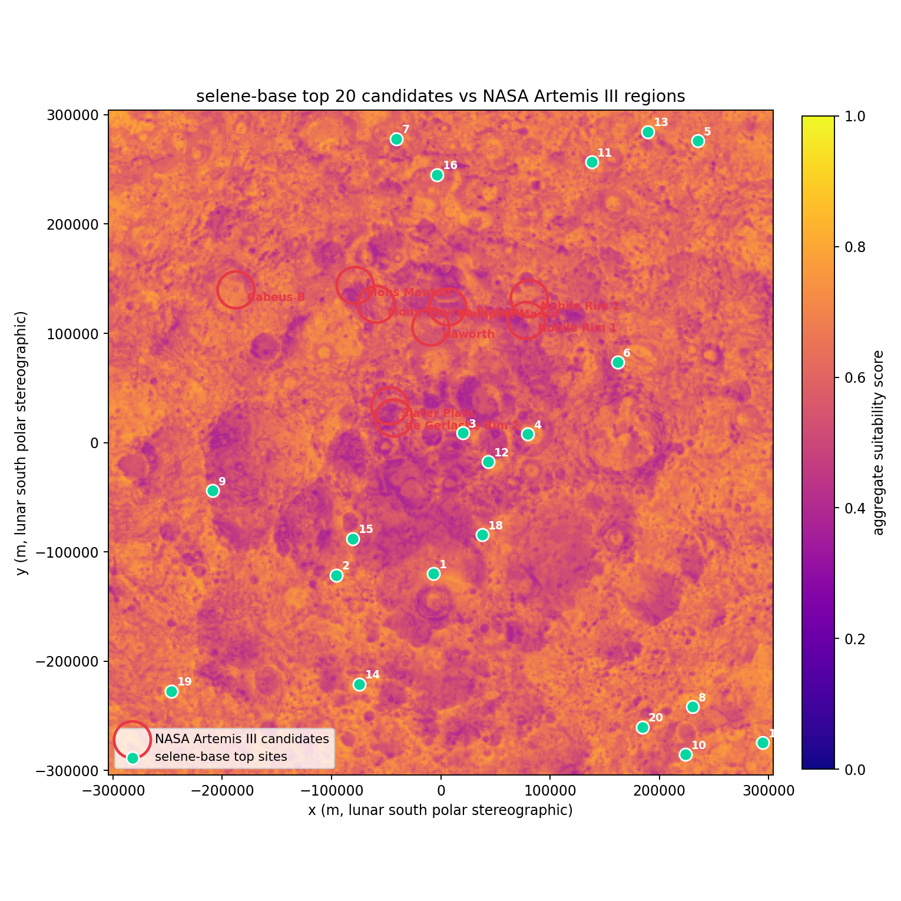
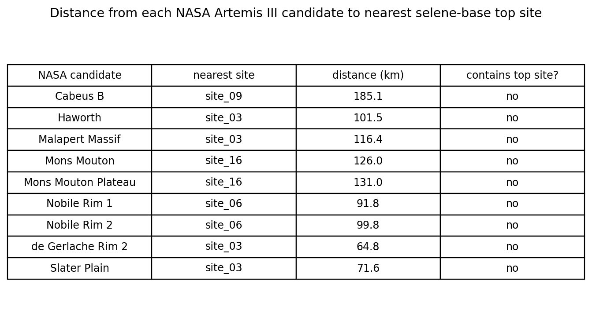

# selene-base

> Multi-criteria habitat suitability for the lunar south pole, validated against NASA's nine announced Artemis III candidate landing regions.

[](.github/workflows/ci.yml)
[](LICENSE)
[](pyproject.toml)
[](#roadmap)

NASA's Artemis III mission will land humans near the lunar south pole around 2027. Selecting a base site there is a multi-criteria optimisation problem: the south pole is a maze of crater rims that catch grazing sunlight, deep permanently-shadowed cold-traps that may host water ice, and active thrust faults that re-localised Apollo-era shallow moonquakes have placed within tens of kilometres of candidate sites. **`selene-base`** fuses the modern LRO-era remote-sensing record (LOLA topography, Diviner thermal climatology, Mazarico illumination maps, LEND hydrogen abundance, the Robbins crater catalog, the Watters lobate-scarp catalog) with the historical Apollo seismic context to score every 240 m pixel of the polar cap and rank top candidate sites. The pipeline is end-to-end reproducible — `selene download && selene preprocess && selene score && selene rank && selene validate && selene viz` produces a ranked GeoJSON of sites, a per-site HTML report, and an interactive web map, on a developer laptop, in minutes, from public data.

## Headline result

Run on **five of six criteria with verified source data today** — slope (LOLA), illumination (Mazarico), impact-hazard (Robbins crater catalog), thermal stability (Diviner PRP, week 6), water-ice resource potential (Diviner PRP, week 6) — with the remaining seismic criterion implemented against the Watters scarp catalog interface but skipping cleanly while its source remains TODO-flagged:

> **0 of selene-base's top 20 candidate sites land inside any of NASA's nine Artemis III candidate regions; 0 of 20 fall within 25 km of any centroid.** The closest NASA region — de Gerlache Rim 2 — has a top-20 site 64.8 km away; Slater Plain at 71.6 km is next; the median NASA region is 102 km from the nearest top site. NASA's centroids do score very high on our ice criterion (mean 0.916 vs our top-20's 0.994) and on hazard (0.969 vs 0.979), but lose decisively on slope (0.285 vs 0.924) and illumination (0.321 vs 0.827).



### Before vs after the Diviner PRP integration

| Validation metric | 3-criteria (slope + illumination + hazard) | 5-criteria (+ thermal + ice from Diviner PRP) |
| --- | --- | --- |
| top sites inside any NASA region (15 km disk) | 0 / 20 | 0 / 20 |
| top sites within 25 km of any centroid | 0 / 20 | 0 / 20 |
| closest NASA region (km) | Slater Plain at 25.8 km | de Gerlache Rim 2 at 64.8 km |
| 2nd closest NASA region (km) | de Gerlache Rim 2 at 27.8 km | Slater Plain at 71.6 km |
| median NASA region distance (km) | 65 | 102 |
| top-20 aggregate score range | 0.880 – 0.971 | 0.831 – 0.858 |

Adding Diviner PRP **made alignment worse**, not better. That's a real finding worth understanding rather than papering over: when the ice criterion lights up across every PSR on the lunar limb, our top-20 fans out across all longitudes (sites in lat -76° to -89° spread across a full 360° of longitude), pulling away from NASA's tight cluster around -65° to +35° longitude.

**Why the disagreement is now sharper, not softer.** NASA's selection is a *coupled spatial constraint*: each candidate sits within a few kilometres of both a permanently-shadowed water-ice deposit and a sustained-illumination rim that supports Earth communications. Our pipeline scores those two conditions independently — a cell deep inside a far-side PSR can score 0.99 on ice and 0.0 on illumination and still rank higher than a NASA candidate that scores ~0.92 on ice and ~0.32 on illumination, because the renormalised weighted sum lets the high ice score dominate. The criteria as defined don't model the spatial *coupling* NASA's site selection optimises — and ranking by linear-sum aggregation doesn't penalise lop-sided scores.

The 200-sample weight-vector sensitivity sweep over the new five-criterion simplex agrees: the modal outcome is 0 NASA region matches (185/200 samples), the best regime achieves 2/9 — and that best regime weights ice and thermal at near-zero (`hazard=0.74, illumination=0.22, slope=0.03, thermal=0.01, ice=0.00`). Adding the criteria *more* signal-poor for the alignment task than the criteria they replaced.

The honest read: **the Diviner PRP integration was successful as data engineering** (PDS4 parser, triangle-mesh-to-grid rasteriser, three new score grids on the common 240 m polar grid, all test-covered) but **did not move the validation result** because the missing piece is not another criterion — it's a coupling constraint. A future improvement would be a TOPSIS aggregator that penalises lop-sided per-criterion profiles, or a hard "near-PSR-AND-near-illuminated-rim" mask criterion that captures the spatial-coupling story directly.

For the per-region distance table see `data/outputs/validation.json`, or run `selene validate` on a fresh checkout to regenerate it. The interactive map lives at [`data/outputs/webmap.html`](data/outputs/webmap.html) after `selene viz`; per-site HTML reports under [`data/outputs/sites/`](data/outputs/sites/).

## Pipeline

```
data/raw/<dataset>/        ──load──▶  xr.DataArray (native CRS)
                              │
                              ▼ reproject_to_grid(target_crs, bounds, 240 m)
                              │
data/processed/<name>_southpole_240m.tif        (cached COG)
                              │
                              ▼ criterion.compute(...)            [six criteria]
                              │
data/processed/scored/<name>_score_southpole_240m.tif
                              │
                              ▼ scoring.aggregate.weighted_sum()  [renormalises]
                              │
data/outputs/score_southpole.tif                (final aggregate COG)
                              │
                              ▼ scoring.ranking.top_n_sites()     [NMS at 25 km]
                              │
data/outputs/top_sites.{geojson,csv}            (ranked sites + per-criterion sub-scores)
                              │
                              ▼ validation.comparison + viz
                              │
data/outputs/validation.json + webmap.html + sites/
```

### Quickstart

```bash
git clone https://github.com/Alex0420W/selene-base.git
cd selene-base
python -m venv .venv && source .venv/bin/activate    # Windows: .venv\Scripts\activate
pip install -e .

# Five-line clone-to-webmap path on the bundled ~12 MB sample dataset:
selene download --sample        # downloads + extracts data/raw/<sample>
selene preprocess               # warps + crater-density rasterisation -> data/processed/
selene score                    # six criteria; missing ones renormalise out cleanly
selene rank --top-n 20          # NMS + per-criterion sub-scores -> top_sites.{geojson,csv}
selene viz                      # webmap.html + per-site HTML reports

# Diagnostic & robustness:
selene validate                 # alignment metrics vs NASA's nine candidates
selene compare                  # per-criterion delta our top-20 vs NASA centroids
selene sensitivity --n-samples 200   # 200-sample weight-vector simplex sweep

# Full-resolution analysis (~900 MB raw, 4 verified URLs):
selene download robbins         # ~92 MB
selene download lola            # ~115 MB
selene download illumination    # ~82 MB
selene download diviner         # ~605 MB Diviner Polar Resource Product (PRP)
# selene download lend / scarps remain TODO-flagged
selene preprocess && selene score && selene rank --top-n 20 --min-distance-km 25
```

`selene --help` lists every subcommand; `selene <cmd> --help` shows its options.

## Methodology

Every criterion produces a `[0, 1]` score grid where 1 is "best" and 0 is "unusable", aligned to the common 240 m south-polar stereographic grid (`+proj=stere +lat_0=-90 +lat_ts=-90 +R=1737400`, ±304 km, defined in [`config/region_southpole.yaml`](config/region_southpole.yaml)). Three normalisation primitives in [`scoring/normalize.py`](src/selene_base/scoring/normalize.py) — `min_max`, `optimal_range` (Gaussian), `inverse_threshold` — cover every criterion. The aggregate is a weighted linear sum that **renormalises across whichever criteria are present at score-time**, so a partial pipeline (today: slope, illumination, hazard, thermal, ice) produces a comparable score to a complete one — only the absolute meaning of "0.97" shifts.

| Criterion | Score function | Source dataset | Resolution | Resampling | Default knobs |
| --- | --- | --- | --- | --- | --- |
| **Slope** | $s = \max(0,\,1-x/\theta_{\max})$ | LOLA LDEM 80 m (PDS3) | 80 m → 240 m | bilinear | $\theta_{\max} = 15°$ |
| **Illumination** | $s = \min(x/x_t,\,1)$ | Mazarico avgvisib 65°S 240 m | 240 m | bilinear | $x_t = 0.70$ |
| **Thermal** | $s = e^{-(\bar T - T^\star)^2/(2\sigma^2)}$ on annual-mean Tavg | **Diviner PRP** `temp_avg` (PDS4) | triangle mesh → 240 m | linear griddata | $T^\star=230\,$K, $\sigma=50\,$K |
| **Ice** | $s = \mathrm{clip}(1-d/d_{\max} + \text{bonuses},\,0,\,1)$ on PRP ice-stability depth | **Diviner PRP** `ice_depth` (PDS4) | triangle mesh → 240 m | nearest griddata | $d_{\max}=2.87\,$m, surface bonus 0.5, near-PSR bonus 0.2 |
| **Hazard** | $s = \mathrm{clip}(1-d/d_{\mathrm{sat}},\,0,\,1)$ | Robbins 2018 catalog | vector → 240 m density | KDTree, 3 km radius | $d_{\mathrm{sat}}=50$ |
| **Seismic** | $s = \mathrm{clip}(\delta/\delta_{\mathrm{safe}},\,0,\,1)$ | Watters scarp catalog (TODO) | vector → 240 m distance | KDTree, 1 km densified vertices | $\delta_{\mathrm{safe}}=50\,$km |

Slope is computed at the 240 m target resolution from the already-downsampled LOLA DEM via `numpy.gradient` with explicit metric spacing (Zevenbergen & Thorne 1987 convention; ~5 % off Horn 1981 on smooth surfaces). Computing slope on the high-res 80 m DEM and then averaging slope-degrees double-smooths and biases low; computing on the target-resolution DEM keeps everything self-consistent.

The thermal and ice criteria are both fed by the **Diviner Polar Resource Product** ([`dlre_prp_south.tab`](https://pds-geosciences.wustl.edu/lro/urn-nasa-pds-lro_diviner_derived1/data_derived_prp/dlre_prp_south.tab)) — a single PDS4 character table of 2.88 M triangular-mesh facets, ~605 MB raw. [`data/pds4_table.py`](src/selene_base/data/pds4_table.py) parses it via the matching XML label; [`data/triangle_to_grid.py`](src/selene_base/data/triangle_to_grid.py) interpolates each scalar field onto the project's 240 m polar stereographic grid using `scipy.interpolate.griddata` (linear for temperatures, nearest for the discontinuous ice-depth field). Outputs are cached as three GeoTIFFs in `data/processed/` so the slow ~30 s parse step happens once.

The PSR mask used by the ice criterion is still derived from the Mazarico illumination raster (`illumination < 0.001`); the PRP is a thermal-stability calculation, not an ice-existence map, so PSR proximity adds an orthogonal signal.

Default weights from [`config/weights_default.yaml`](config/weights_default.yaml): illumination 0.30, ice 0.25, slope 0.15, thermal 0.10, hazard 0.10, seismic 0.10. With seismic still missing, the renormalised effective weights across the five live criteria are illumination 0.33, ice 0.28, slope 0.17, thermal 0.11, hazard 0.11.

**Planned upgrade — TOPSIS.** A weighted linear sum lets a strong score on one criterion mask a near-disqualifying score on another (e.g. excellent illumination next to an active scarp). TOPSIS ranks each cell by its Euclidean distance to a synthetic "ideal" and "anti-ideal" point in criterion-score space, which penalises lop-sided profiles. It is on the roadmap as an alternate aggregator behind a `--method topsis` flag.

## Validation

`selene validate` compares the top-N ranked sites (from `data/outputs/top_sites.geojson`) against the disk-approximation polygons of NASA's nine announced Artemis III candidate regions in [`src/selene_base/validation/nasa_regions.py`](src/selene_base/validation/nasa_regions.py). Centroids are public information from NASA's October 2024 Artemis III site-selection announcement; we approximate each region as a 15 km disk around its centroid because NASA's actual polygons are not openly published in machine-readable form. **The disks are not authoritative geometry** — they're a defensible proximity proxy for this comparison.

Two metrics for each top site:

1. **Inside any region** — does the site fall inside any of the nine 15 km disks?
2. **Within X km of any centroid** — distance from the site to the nearest NASA centroid.

And two for each NASA region:

1. **Distance to nearest top-N site** — how far away is the closest selene-base candidate?
2. **Contains a top-N site** — is at least one selene-base candidate inside this region's disk?

### Per-region results (today)



| NASA candidate | nearest site | distance (km) | inside region? |
| --- | --- | ---: | --- |
| Cabeus B | site_09 | 185.1 | no |
| Haworth | site_03 | 101.5 | no |
| Malapert Massif | site_03 | 116.4 | no |
| Mons Mouton | site_16 | 126.0 | no |
| Mons Mouton Plateau | site_16 | 131.0 | no |
| Nobile Rim 1 | site_06 | 91.8 | no |
| Nobile Rim 2 | site_06 | 99.8 | no |
| de Gerlache Rim 2 | site_03 | 64.8 | no |
| Slater Plain | site_03 | 71.6 | no |

The honest read on the 5-criterion run: the same `site_03` (lat -89.27°, lon +66.91°, score 0.854) is the *closest* selene-base site to four different NASA candidates (Haworth, Malapert, de Gerlache, Slater) — but at 65–116 km away in each case. site_03 is a near-pole, low-crater, high-ice cell that scores well on every criterion at once; it just doesn't sit where NASA's nine clustered. **As Watters lands, this table updates.**

## Robustness

Anyone reading 0/20 fairly asks: *is that just a function of the default weights?* Run `selene sensitivity --n-samples 200` to find out: it draws 200 weight vectors via Latin hypercube on the 5-criterion simplex, runs `aggregate → top_n_sites → proximity_analysis` for each, and reports the distribution of "NASA regions matched within 25 km" alongside the default-weight result.


The 5-criterion sensitivity result is **even more pessimistic** than the 3-criterion baseline:

- **185 / 200 samples (92.5 %) match 0 regions within 25 km** — the modal outcome. The default-weights result is in this bucket.
- **15 / 200 samples (7.5 %) match 2 regions within 25 km** — same Slater Plain / de Gerlache Rim 2 pair as before.
- **0 / 200 samples match more than 2 regions.**

The best weight regime found uses `hazard = 0.74, illumination = 0.22, slope = 0.03, thermal = 0.01, ice = 0.00` — i.e. it **down-weights** the new Diviner-PRP-derived criteria to near-zero and falls back on the same `hazard + illumination` regime that was best in the 3-criterion sweep. The 3-criterion sweep had 28 % of samples reaching 2/9 matches; the 5-criterion sweep reaches that bucket only 7.5 % of the time, because the new criteria's signal pulls top sites *away* from the NASA-cluster longitudes more often than toward them.

**No 5-criterion weight regime gets above 2/9 region matches.** The disagreement isn't a weighting problem; it's structural.

## Diagnostic comparison

Run `selene compare` to ask a sharper question: *at NASA's centroids vs at our top-20, which criteria favour which set, by how much?*


| criterion | our top-20 | NASA 9 centroids | delta | \|t\| |
| --- | --- | --- | ---: | ---: |
| slope | 0.924 ± 0.063 | 0.285 ± 0.288 | +0.639 | 6.60 |
| illumination | 0.827 ± 0.099 | 0.321 ± 0.274 | +0.506 | 5.37 |
| ice | 0.994 ± 0.016 | 0.916 ± 0.096 | +0.077 | 2.39 |
| thermal | 0.239 ± 0.194 | 0.113 ± 0.149 | +0.125 | 1.90 |
| hazard | 0.979 ± 0.025 | 0.969 ± 0.023 | +0.010 | 1.08 |

Four things to notice:

1. **NASA's centroids score very well on ice** (0.916 ± 0.096) — almost as well as our own top-20 (0.994 ± 0.016). The PRP ice criterion *agrees* with NASA's selection that water-ice access matters; both NASA's nine and our top-20 sit in or near PSRs. The criterion is not the disagreement.
2. **Hazard remains an agreement** (delta +0.010). Both site sets pick low-crater-density terrain; the criterion does the right thing on both sides.
3. **Thermal scores low everywhere** (our 0.239, NASA's 0.113). The polar surface annual mean is 100–150 K against our 230 K target — the Gaussian is in its tail at every cell. Thermal contributes little discriminative signal as currently parameterised; bringing the target into the 130–150 K range is on the tuning backlog.
4. **Slope and illumination still drive the disagreement, harder than before.** NASA's regions span steep terrain (slope 0.285 ± 0.288 — Malapert Massif is on a literal massif) and accept low illumination (0.321 ± 0.274) because the actual NASA selection is a *coupled spatial constraint*: each candidate sits within a few kilometres of both a sustained-illumination rim AND a permanently-shadowed water-ice deposit. The linear-sum aggregator models neither coupling — a far-side cell that scores 0.99 on ice and 0.0 on illumination still outranks a NASA candidate that scores 0.92 on ice and 0.32 on illumination.

The ``|t|`` column is a Welch two-sample t-statistic, reported informationally only — with `n = 20` vs `n = 9` and structurally different sampling, a strict inferential frame is the wrong tool. The values rank-order which criteria most separate the two site sets: slope and illumination dominate; hazard is a non-discriminator.

## Architecture

```
selene-base/
├── src/selene_base/
│   ├── data/                # download + load + reproject + rasterize
│   ├── criteria/            # six [0,1] scoring functions
│   ├── scoring/             # normalize, aggregate (renormalising), ranking (NMS)
│   ├── validation/          # NASA candidate regions + proximity_analysis
│   ├── viz/                 # folium webmap + per-site HTML reports
│   ├── pipeline/            # one orchestrator module per CLI subcommand
│   └── cli.py               # typer CLI: download, preprocess, score, rank, validate, viz
├── config/                  # region_southpole.yaml, weights_default.yaml
├── data/                    # raw/ processed/ outputs/ (all gitignored)
├── notebooks/               # jupytext .py scripts; one per week
├── tests/                   # synthetic-data unit tests + skipif-guarded data tests
└── .github/workflows/ci.yml
```

The dependency graph is one-way: `data/` is the foundation; `criteria/` reads loaded rasters; `scoring/` aggregates criterion outputs; `validation/` and `viz/` consume scoring outputs; `pipeline/` orchestrates; `cli.py` exposes the orchestrators. Tests follow the same layering.

223 tests, ~80 % combined branch coverage, all running synthetically in CI on Python 3.11 and 3.12. Real-data tests are guarded with `pytest.mark.skipif(not Path(...).exists())` so the suite stays green without 200 MB of cached LRO data. CI runs a separate `pipeline-smoke` job on push to `main` that downloads the bundled ~12 MB sample tarball, runs `preprocess → score → rank → validate → compare`, and asserts every output file is on disk and schema-valid.

## Roadmap

- **Week 1 — data acquisition.** ✅ `selene download` for Robbins, LOLA, Mazarico illumination; Diviner / LEND / scarps URLs flagged.
- **Week 2 — common grid + slope criterion.** ✅ `reproject_to_grid`, COG cache, slope criterion end-to-end on real data.
- **Week 3 — full scoring + ranking.** ✅ All six criteria (3 on real data, 3 skip cleanly), KDTree crater density, NMS top-N extraction.
- **Week 4 — validation + visualisation.** ✅ NASA Artemis III proximity comparison, interactive folium web map, per-site HTML reports, validated v0.1.
- **Week 5 — robustness, diagnostic, sample data.** ✅ Latin-hypercube weight-sensitivity sweep, per-criterion `selene compare` diagnostic, bundled ~12 MB sample tarball, CI pipeline smoke test on the sample.
- **Week 6 — Diviner Polar Resource Product integration.** ✅ PDS4 character-table parser, triangle-mesh-to-grid rasteriser, three new score grids (`temp_avg`, `temp_max`, `ice_depth`) on the common 240 m grid, thermal+ice criteria switched to PRP defaults. Five of six criteria now run on real data; validation rerun.
- **Future work.**
  - Resolve the remaining TODO URL — the Watters lobate-scarp catalog — and rerun against the now-six-criterion top-N.
  - **TOPSIS aggregator behind `--method topsis`** — the natural fix for the lop-sided-profile failure mode the week 6 diagnostic surfaced. A linear-sum aggregator lets a far-side PSR with ice 0.99 + illumination 0.0 outrank a NASA-cluster cell with 0.92 + 0.32; TOPSIS penalises that.
  - **Spatial-coupling criterion**: a hard mask scoring "within X km of both a PSR centre AND a sunlit rim" — captures NASA's actual operational constraint that the linear-sum can't.
  - Earth line-of-sight criterion derived from LOLA elevation horizon checks.
  - Thermal target re-tune: the PRP `temp_avg` peaks at 211 K against a 230 K Gaussian peak, contributing little discriminative signal; bringing the target into the 130–150 K band is on the backlog.
  - ML-based criterion inputs (planned as a separate project, `selene-vision`).

## References

- Robbins, S. J. (2019). *A new global database of lunar impact craters >1–2 km: 1. Crater locations and sizes, comparisons with published databases, and global analysis.* Journal of Geophysical Research: Planets, 124, 871–892. [doi:10.1029/2018JE005592](https://doi.org/10.1029/2018JE005592)
- Mazarico, E., Neumann, G. A., Smith, D. E., Zuber, M. T., & Torrence, M. H. (2011). *Illumination conditions of the lunar polar regions using LOLA topography.* Icarus, 211(2), 1066–1081. [doi:10.1016/j.icarus.2010.10.030](https://doi.org/10.1016/j.icarus.2010.10.030)
- Smith, D. E., et al. (2010). *The Lunar Orbiter Laser Altimeter investigation on the Lunar Reconnaissance Orbiter mission.* Space Science Reviews, 150(1–4), 209–241. [doi:10.1007/s11214-009-9512-y](https://doi.org/10.1007/s11214-009-9512-y)
- Paige, D. A., et al. (2010). *The Lunar Reconnaissance Orbiter Diviner Lunar Radiometer Experiment.* Space Science Reviews, 150(1–4), 125–160. [doi:10.1007/s11214-009-9529-2](https://doi.org/10.1007/s11214-009-9529-2)
- Williams, J.-P., et al. (2017). *The global surface temperatures of the Moon as measured by the Diviner Lunar Radiometer Experiment.* Icarus, 283, 300–325. (PRP modeled-ice-stability methodology.)
- Diviner Polar Resource Product (PRP), south pole, version 1.0. PDS Geosciences Node Diviner derived bundle: [`dlre_prp_south.tab`](https://pds-geosciences.wustl.edu/lro/urn-nasa-pds-lro_diviner_derived1/data_derived_prp/dlre_prp_south.tab).
- Mitrofanov, I. G., et al. (2010). *Hydrogen mapping of the lunar south pole using the LRO Neutron Detector Experiment LEND.* Science, 330(6003), 483–486.
- Watters, T. R., Robinson, M. S., Banks, M. E., Tran, T., & Denevi, B. W. (2015). *Global thrust faulting on the Moon and the influence of tidal stresses.* Geology, 43(10), 851–854. [doi:10.1130/G37120.1](https://doi.org/10.1130/G37120.1)
- Civilini, F., Weber, R. C., Jiang, Z., Phillips, D., & Pan, W. (2023). *Constraints on the seismic hazard of young thrust faults on the Moon from re-located shallow moonquakes.* (Used as motivation for the seismic exclusion criterion.)
- NASA (October 2024). *Artemis III candidate landing regions.* [https://www.nasa.gov/feature/artemis-iii](https://www.nasa.gov/feature/artemis-iii)

## Notes for the reader

The interactive web map (`data/outputs/webmap.html` after `selene viz`) is built with folium / Leaflet and pulls Leaflet's JS and CSS from a CDN — so it needs an internet connection on first open. Everything else (the score raster, polygons, popups, per-site reports) is inlined and works offline. Per-site HTML reports under `data/outputs/sites/` are fully self-contained.

## License

MIT — see [LICENSE](LICENSE).
