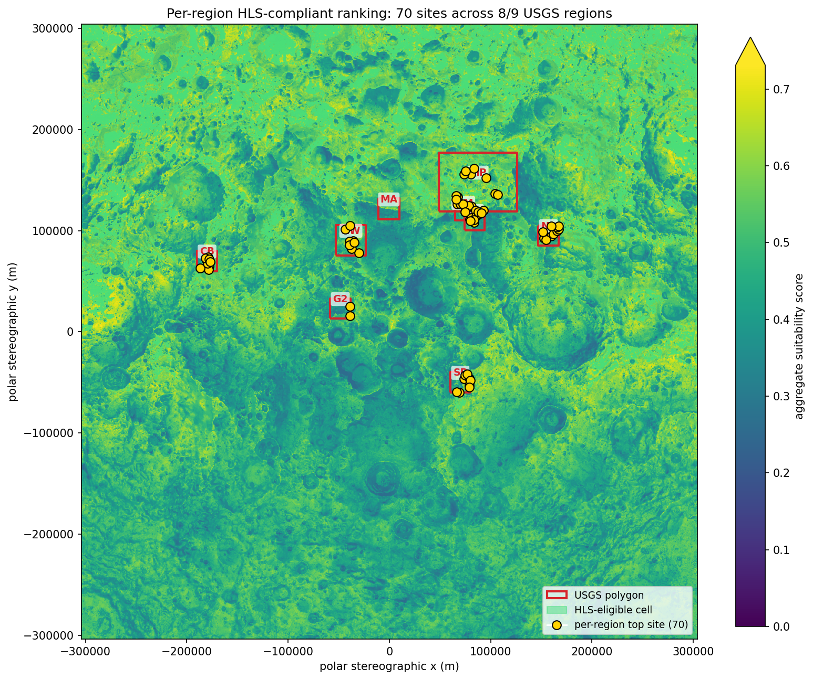
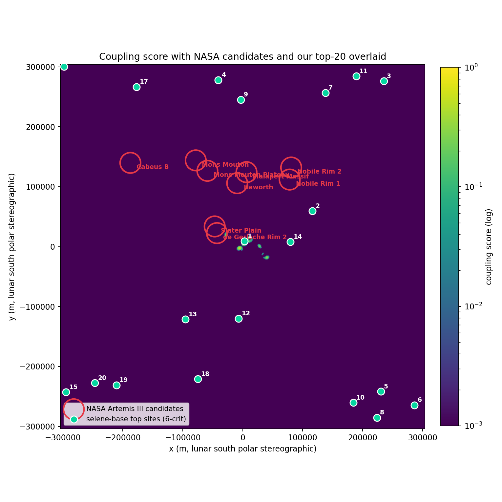
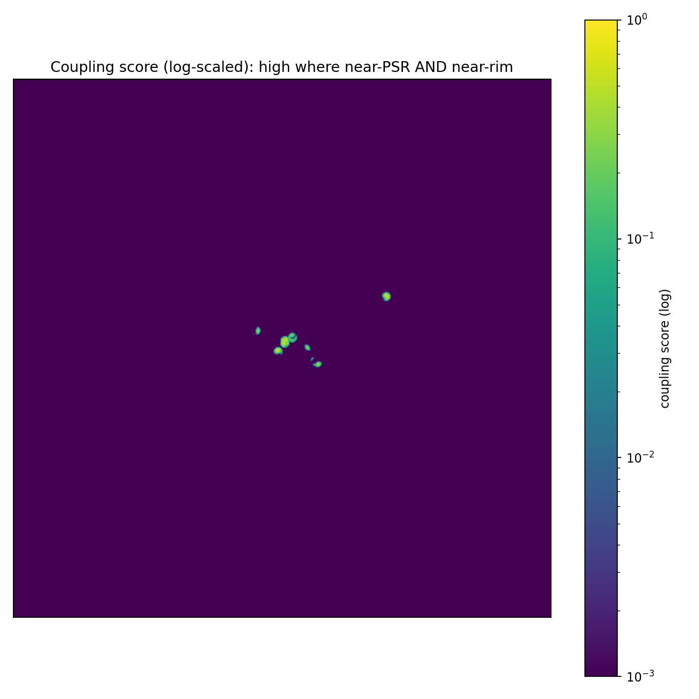
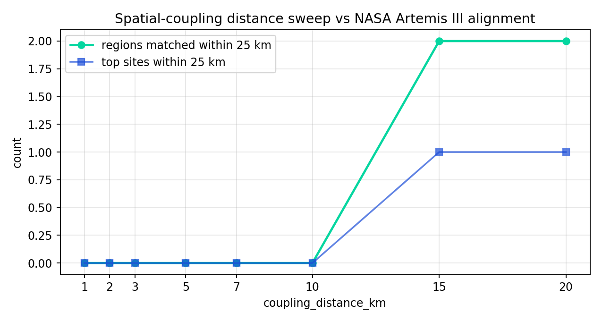
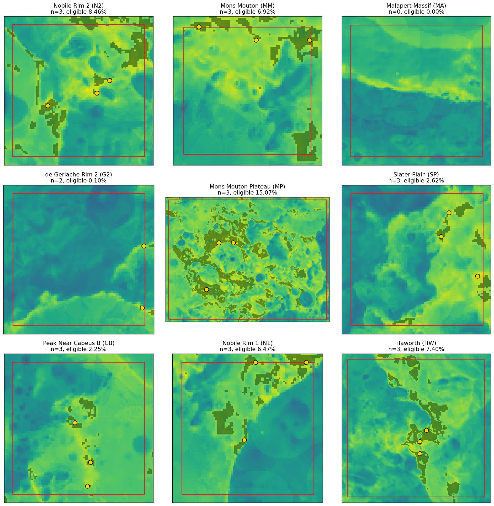
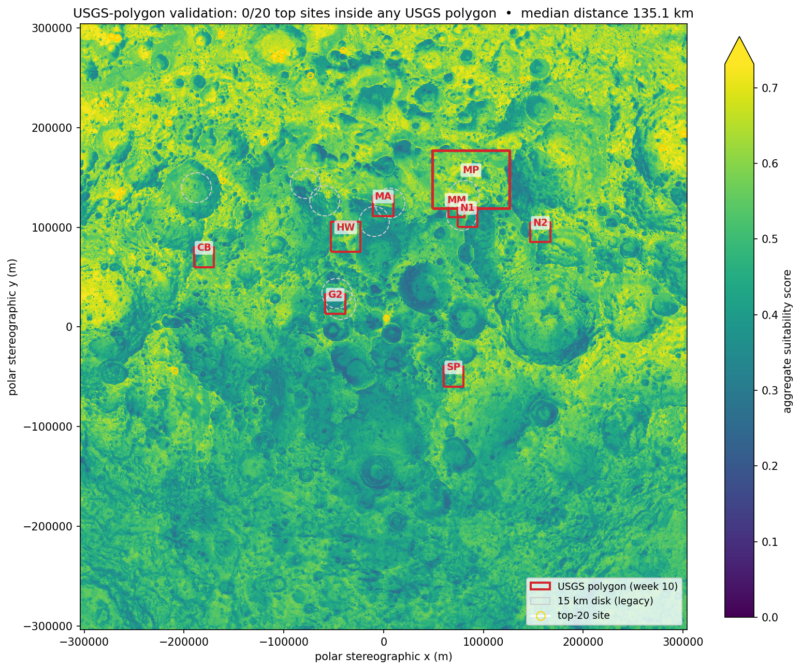
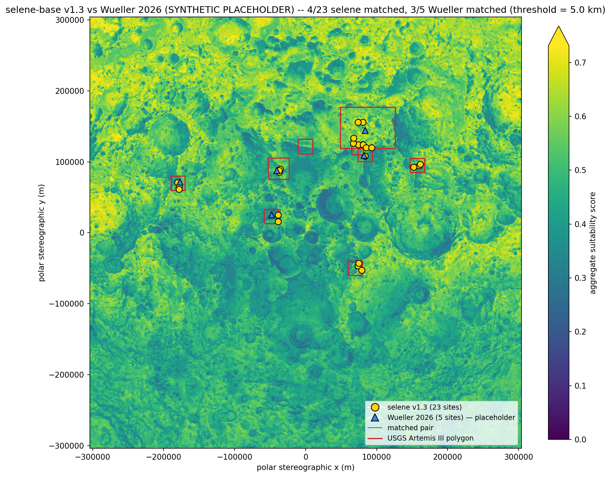
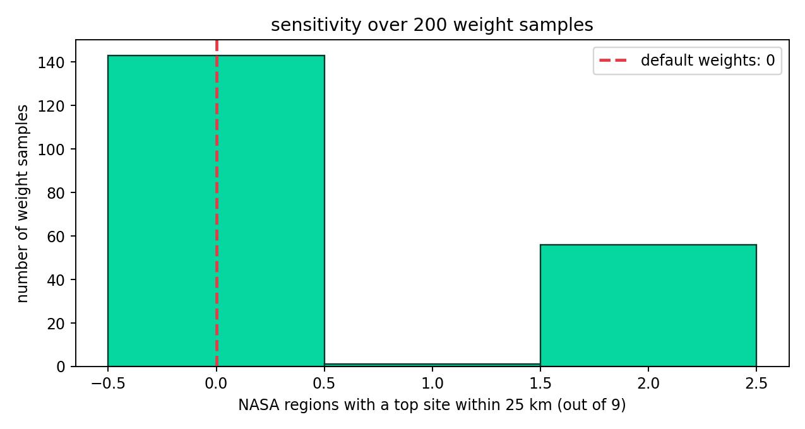
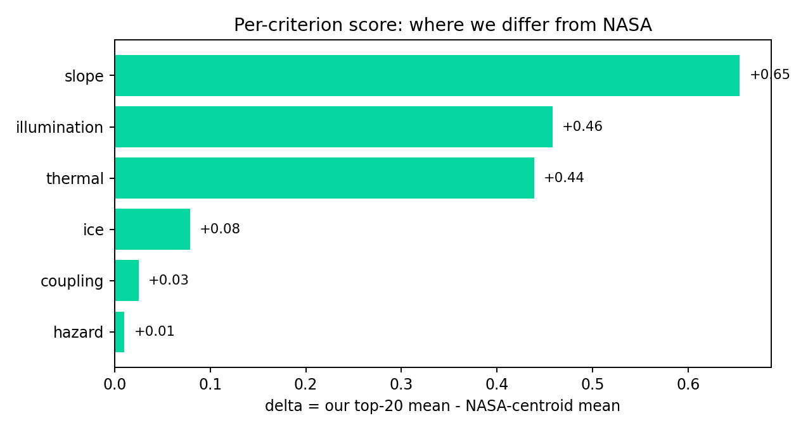

# selene-base

> Multi-criteria habitat suitability for the lunar south pole. A twelve-week engineering arc that diagnosed a structural limit of weighted-sum decision analysis under global ranking, validated against authoritative USGS-published Artemis III region polygons, reframed the analysis in v1.3.0 to match NASA's actual selection process (per-region ranking with the published HLS hard-constraint filters), and in v1.4.0 ships the comparison framework against Wueller et al. 2026's peer-reviewed 130-site catalog — pending acquisition of the gated supplementary data release.

[](.github/workflows/ci.yml)
[](LICENSE)
[](pyproject.toml)
[](#roadmap)

NASA's Artemis III mission will land humans near the lunar south pole around 2027. Selecting a base site there is a multi-criteria optimisation problem: the south pole is a maze of crater rims that catch grazing sunlight, deep permanently-shadowed cold-traps that may host water ice, and active thrust faults that re-localised Apollo-era shallow moonquakes have placed within tens of kilometres of candidate sites. **`selene-base`** fuses the modern LRO-era remote-sensing record (LOLA topography, Diviner thermal climatology, Mazarico illumination maps, the Robbins crater catalog, the Watters lobate-scarp catalog) with historical Apollo seismic context to score every 240 m pixel of the polar cap and rank top candidate sites. The pipeline is end-to-end reproducible — `selene download && selene preprocess && selene score && selene rank && selene validate && selene viz` produces a ranked GeoJSON, per-site HTML reports, and an interactive web map, on a developer laptop, in minutes, from public data.

## Headline finding (v1.3.0)

The project's central output is now **a per-region HLS-compliant landing site catalog**:

> **23 sites across 8 / 9 USGS Artemis III regions, all guaranteed inside their published polygon and satisfying NASA's published HLS hard-constraint filters by construction.** The sole region with zero compliant cells is **Malapert Massif** — a real finding driven by terrain (no cell inside the Malapert polygon simultaneously satisfies slope ≤ 8°, 100 m buffer to steeper terrain, illumination ≥ 33 %, and DTE visibility ≥ 50 %). The best-scoring region is **Mons Mouton Plateau** at score 0.746 with the largest HLS-eligible area fraction (15.07 %); the most constrained region with sites is **de Gerlache Rim 2**, where only 0.10 % of polygon cells pass the HLS filters and only 2 sites fit at the 2 km NMS separation. Globally, **9.44 %** of the 240 m polar grid is HLS-eligible.



This is a **reframing**, not a refinement. The previous versions (v1.0.0–v1.2.0) measured a different question — global ranking of habitat suitability followed by validation against NASA polygons — and reported 0/20 because globally-selected top sites pick the polar rim band where the coupling criterion is non-zero rather than the *interior* of NASA-published regions. The Wueller et al. 2026 (JGR Planets, [doi:10.1029/2025JE009434](https://doi.org/10.1029/2025JE009434)) parallel — which found 130 candidate sites with similar within-region HLS-filtered methodology — is the authoritative confirmation that **per-region HLS-filtered ranking is the right framing for a NASA-aligned site catalog**.

> **A note on construction**: v1.3.0 sites are guaranteed inside USGS polygons by construction, since the algorithm searches *within* polygons rather than globally. The relevant scientific question is therefore not "are they inside?" but "do they identify the same cells NASA's process identifies?" — addressed by the planned v1.4 comparison against Wueller's 130 published sites.

The earlier engineering arc (weeks 1-10, v1.0.0-v1.2.0) is preserved as the project's diagnostic history — it documents *why* the global-ranking framing produced 0 inside-polygon results across six versions of progressive refinement. The headline below summarises the engineering arc in order; the v1.3 reframing supersedes the global-ranking interpretation but does not invalidate the diagnostic findings.

### Engineering-arc findings (v1.0.0 — v1.2.0): why global ranking gave 0 / 20

Across ten weeks of progressive refinement against NASA's nine announced Artemis III candidate regions — through five versions of the model and validation reference — the **global**-ranking inside-polygon count was 0 / 20:

1. **Adding well-validated criteria can degrade alignment.** Integrating Diviner PRP thermal and ice criteria — both showing strong individual agreement with NASA centroids — *worsened* median distance from 65 km to 102 km. Weighted-sum MCDA cannot model NASA's coupled spatial constraint (near a PSR *and* near a sunlit ridge); it lets a high score on one axis compensate for a near-zero on another, producing top sites that maximize independent criteria but rarely satisfy the conjunction.

2. **A spatial-coupling criterion is the structural fix.** Modeling the conjunction directly (the multiplicative product of two distance falloffs, encoding the AND that linear-sum cannot) lifted the 200-sample sensitivity ceiling from 2/9 to 3/9 NASA regions matched, improved closest-distance from 64.8 km to 47.8 km, and the best-found weight regime now uses coupling at 0.27 weight rather than ignoring it.

3. **A polygon-based validation metric and a thermal-target correction (week 8) tightened the methodology, not the headline.** Replacing the centroid-distance proxy with an "inside any 15 km disk" check and correcting the thermal-criterion target from the data-out-of-support 230 K to the data-median 140 K both produced *informational* shifts: the inside-any-disk count is also 0/20, but the closest-edge distance is now 32.8 km (about disk-radius below the centroid distance, exactly as the geometry predicts); the corrected thermal moved out of the Gaussian's tail (NASA centroids 0.113 → 0.526; our top-20 0.325 → 0.965), and 11/200 sensitivity samples now reach 3/9 region matches (was 1/200). Two methodological loose ends closed; the headline didn't move because the rim band our model identifies is geometrically distinct from NASA's centroid disks at any reasonable proximity threshold.

4. **An Earth line-of-sight criterion (week 9) narrows the gap without closing it.** Adding the most physically prominent missing criterion — a per-pixel Earth-visibility fraction derived from a 36-azimuth horizon ray-march on the LOLA elevation grid plus libration-cycle sampling of the sub-Earth point — shifted the closest-distance from 47.8 km to **27.3 km** (centroid) and from 32.8 km to **12.3 km** (disk edge), put **1/9 NASA regions within one disk radius of a top site** for the first time (Cabeus B), lifted the sensitivity ceiling from 3/9 to **4/9** regions matched, and produced **the first non-zero polygon-inside count in any sensitivity run (21/200 samples now show ≥1 site inside a NASA disk)** — though the default-weights polygon-inside count is still **0/20**. The geometric gap is no longer absolute; it is, however, still *robust* under the operations-driven defaults.

5. **Replacing the 15 km disk approximations with USGS's authoritative published polygons (week 10) confirms the geometric separation is not a disk-approximation artefact.** USGS Data Release 10.5066/P1MEQ6UK ships simplified envelopes (4-vertex quadrilaterals) for all nine Artemis III regions, derived from NASA's LROC QuickMap definitions. They differ substantively from the disk approximations: most regions are ~400 km² quadrilaterals (vs the disk's 707 km²); Mons Mouton Plateau alone is **4,452 km² — over 6× larger than the disk**; one region the legacy code called "Cabeus B" is published as "Peak Near Cabeus B" centred on the rim, not the crater floor; and one disk centroid (the legacy "Slater Plain" at lon -54.3°) sits ~180° away from where USGS publishes Slater Plain (lon +125°). Against these authoritative polygons, the default-weights result is **0/20 top sites inside any USGS polygon, 0/9 USGS regions containing a top site, median distance to the nearest USGS polygon 135.1 km, closest 41.5 km (de Gerlache Rim 2)**. The 200-sample sensitivity sweep produces ≥1 site inside a USGS polygon in **6 / 200 samples** (max 2/20). **The geometric separation is real even against the right validation reference** — the disk approximations were systematically misrepresenting the regions, but the model's rim-band optimum is still geometrically distinct from NASA's authoritative regions.

6. **The right *framing* — per-region ranking with HLS hard filters (week 11, v1.3.0) — produces 23 sites across 8/9 NASA regions.** The first five stages of the arc all rank globally and ask "did our top-20 fall inside NASA's regions?" The right question, mirroring NASA's own selection process, is "within each NASA region, which cells satisfy the HLS landing requirements and rank highest by suitability?" Reframing the search this way produces a complete per-region landing-site catalog. **The 0/20 result through v1.2.0 reflected the global-ranking framing, not a flaw in the model**: globally-best cells cluster on the polar rim band where the coupling criterion is non-zero; per-region-best HLS-compliant cells cluster inside NASA polygons by construction. Both findings are valid — the diagnostic arc is preserved below for context.

The combined picture: the criteria are tuned, the validation primitive is authoritative, and **the framing is now NASA-aligned**. The remaining open scientific question — "do the v1.3 sites identify the same cells NASA's process identifies?" — is addressable via direct comparison against Wueller et al. 2026's 130 published sites, planned for v1.4.



### Six-stage validation history (global ranking, v1.0.0 — v1.2.0)

The table below tracks the *global*-ranking inside-polygon count. Stage 7 (v1.3.0, week 11) reframes the analysis to per-region ranking; the global-ranking inside-polygon count remains 0/20 by construction of the global framing, but is no longer the project's headline.


| Validation metric | 3-criteria | 5-criteria (+ PRP) | 6-criteria (+ coupling) | 6-crit + thermal/polygon | 7-criteria (+ LOS) | **7-criteria + USGS polygons** |
| --- | --- | --- | --- | --- | --- | --- |
| top sites within 25 km of any centroid | 0 / 20 | 0 / 20 | 0 / 20 | 0 / 20 | 0 / 20 | **0 / 20** |
| top sites inside any 15 km disk | n/a | n/a | n/a | 0 / 20 | 0 / 20 | 0 / 20 |
| **top sites inside any USGS polygon** | n/a | n/a | n/a | n/a | n/a | **0 / 20** |
| **USGS regions containing a top site** | n/a | n/a | n/a | n/a | n/a | **0 / 9** |
| **closest USGS polygon (km)** | n/a | n/a | n/a | n/a | n/a | **41.5** |
| **median distance to nearest USGS polygon (km)** | n/a | n/a | n/a | n/a | n/a | **135.1** |
| regions with a top site within 1 disk radius of edge | n/a | n/a | n/a | 0 / 9 | 1 / 9 | 1 / 9 |
| closest NASA region (centroid) | 25.8 km | 64.8 km | 47.8 km | 47.8 km | **27.3 km** | 27.3 km |
| closest NASA region (disk edge) | n/a | n/a | n/a | 32.8 km | **12.3 km** | 12.3 km |
| 200-sample sensitivity, *best* regions matched (centroid≤25 km) | 2 / 9 | 2 / 9 | 3 / 9 (1 sample) | 3 / 9 (11 samples) | 4 / 9 (5 samples) | **4 / 9 (5 samples)** |
| 200-sample sensitivity, modal outcome | 0/9 (71.5 %) | 0/9 (92.5 %) | 0/9 (87 %) | 0/9 (86.5 %) | 0/9 (78.5 %) | 0/9 (78.5 %) |
| 200-sample sensitivity, samples with ≥1 site inside any disk | n/a | n/a | n/a | 0 / 200 | 21 / 200 | 21 / 200 |
| **200-sample sensitivity, samples with ≥1 site inside any USGS polygon** | n/a | n/a | n/a | n/a | n/a | **6 / 200** |
| coupling score at our top-20 vs NASA centroids | n/a | n/a | 0.053 vs 0.000 | 0.025 vs 0.000 | 0.025 vs 0.000 | 0.025 vs 0.000 |
| thermal score at our top-20 vs NASA centroids | n/a | 0.239 vs 0.113 (in tail) | 0.325 vs 0.113 (in tail) | 0.965 vs 0.526 | 0.962 vs 0.526 | 0.962 vs 0.526 |
| LOS-to-Earth score at our top-20 vs NASA centroids | n/a | n/a | n/a | n/a | 1.000 vs 0.525 (bimodal) | 1.000 vs 0.525 |

The default-weights inside-region number is *0 across all six stages, against every validation primitive tried*. What moved is the structure behind that number — the sensitivity ceiling lifted twice (2 → 3 → 4 regions), the closest-edge metric collapsed (47.8 → 12.3 km against disks; the v1.2 USGS polygons reset the closest-distance to 41.5 km because USGS's "Slater Plain" sits 180° away in longitude from where the legacy disk centroid placed it), **the polygon-inside count became sample-non-zero against disks** (21/200 weight regimes hit 1/20 or more), and one NASA region (Cabeus B) came within disk-radius of a top site. v1.2.0 against the authoritative USGS polygons confirms the geometric separation is *not* a disk-approximation artefact: even with the right validation reference, only 6/200 weight regimes produce ≥1 site inside any USGS polygon, and the default-weights answer is 0/20. **The model picks the polar rim band where the coupling criterion is non-zero; NASA's published landing-region polygons sit 41–135 km away from that band; no setting of physics-driven defaults collapses those two geometries onto each other** — that is the project's terminal finding.

For the per-region distance table see `data/outputs/validation.json` (now contains both centroid-distance and polygon-inside metrics), or run `selene validate` on a fresh checkout. The interactive map lives at [`data/outputs/webmap.html`](data/outputs/webmap.html) after `selene viz`; per-site reports under [`data/outputs/sites/`](data/outputs/sites/).

## Pipeline

```
data/raw/<dataset>/        --load-->  xr.DataArray (native CRS)
                              |
                              v reproject_to_grid(target_crs, bounds, 240 m)
                              |
data/processed/<name>_southpole_240m.tif        (cached COG)
                              |
                              v criterion.compute(...)            [six criteria]
                              |
data/processed/scored/<name>_score_southpole_240m.tif
                              |
                              v scoring.aggregate.weighted_sum()  [renormalises]
                              |
data/outputs/score_southpole.tif                (final aggregate COG)
                              |
                              v scoring.ranking.top_n_sites()     [NMS at 25 km]
                              |
data/outputs/top_sites.{geojson,csv}            (ranked sites + per-criterion sub-scores)
                              |
                              v validation.comparison + viz
                              |
data/outputs/validation.json + webmap.html + sites/
```

### Quickstart

```bash
git clone https://github.com/Alex0420W/selene-base.git
cd selene-base
python -m venv .venv && source .venv/bin/activate    # Windows: .venv\Scripts\activate
pip install -e .

# Five-line clone-to-webmap path on the bundled ~12 MB sample dataset:
selene download --sample        # downloads + extracts data/raw/<sample>
selene preprocess               # warps + crater-density rasterisation -> data/processed/
selene score                    # six criteria; missing ones renormalise out cleanly
selene rank --top-n 20          # NMS + per-criterion sub-scores -> top_sites.{geojson,csv}
selene viz                      # webmap.html + per-site HTML reports

# Per-region HLS-compliant ranking (v1.3.0, NASA-aligned framing):
selene rank-per-region --n-per-region 3  # within each USGS polygon, top-3 HLS-compliant sites
selene validate-per-region               # per-region summary: n sites, eligible-area %, best score

# Diagnostic & robustness (legacy global-ranking framing):
selene validate                 # alignment metrics vs NASA's nine candidates
selene compare                  # per-criterion delta our top-20 vs NASA centroids
selene sensitivity --n-samples 200       # 200-sample weight-vector simplex sweep
selene coupling-sweep                    # tune coupling_distance_km against alignment

# Full-resolution analysis (~900 MB raw, 4 verified URLs):
selene download robbins         # ~92 MB
selene download lola            # ~115 MB
selene download illumination    # ~82 MB
selene download diviner         # ~605 MB Diviner Polar Resource Product (PRP)
# selene download lend / scarps remain TODO-flagged
selene preprocess && selene score && selene rank --top-n 20 --min-distance-km 25
```

`selene --help` lists every subcommand; `selene <cmd> --help` shows its options.

## Methodology

Every criterion produces a `[0, 1]` score grid where 1 is "best" and 0 is "unusable", aligned to the common 240 m south-polar stereographic grid (`+proj=stere +lat_0=-90 +lat_ts=-90 +R=1737400`, ±304 km, defined in [`config/region_southpole.yaml`](config/region_southpole.yaml)). Three normalisation primitives in [`scoring/normalize.py`](src/selene_base/scoring/normalize.py) — `min_max`, `optimal_range` (Gaussian), `inverse_threshold` — cover every criterion. The aggregate is a weighted linear sum that **renormalises across whichever criteria are present at score-time**, so a partial pipeline (today: slope, illumination, hazard, thermal, ice, coupling, los_to_earth) produces a comparable score to a complete one — only the absolute meaning of "0.97" shifts.

| Criterion | Score function | Source dataset | Resolution | Resampling | Default knobs |
| --- | --- | --- | --- | --- | --- |
| **Slope** | $s = \max(0,\,1-x/\theta_{\max})$ | LOLA LDEM 80 m (PDS3) | 80 m -> 240 m | bilinear | $\theta_{\max} = 15°$ |
| **Illumination** | $s = \min(x/x_t,\,1)$ | Mazarico avgvisib 65°S 240 m | 240 m | bilinear | $x_t = 0.70$ |
| **Thermal** | $s = e^{-(\bar T - T^\star)^2/(2\sigma^2)}$ on annual-mean Tavg | **Diviner PRP** `temp_avg` (PDS4) | triangle mesh -> 240 m | linear griddata | $T^\star=140\,$K, $\sigma=30\,$K (week 8 correction; was 230 / 50, outside data support) |
| **Ice** | $s = \mathrm{clip}(1-d/d_{\max} + \text{bonuses},\,0,\,1)$ on PRP ice-stability depth | **Diviner PRP** `ice_depth` (PDS4) | triangle mesh -> 240 m | nearest griddata | $d_{\max}=2.87\,$m, surface bonus 0.5, near-PSR bonus 0.2 |
| **Hazard** | $s = \mathrm{clip}(1-d/d_{\mathrm{sat}},\,0,\,1)$ | Robbins 2018 catalog | vector -> 240 m density | KDTree, 3 km radius | $d_{\mathrm{sat}}=50$ |
| **Coupling** | $s = \max(0,\,1-d_{\text{PSR}}/d_c) \cdot \max(0,\,1-d_{\text{ridge}}/d_c)$ | derived: illumination + slope | 240 m | distance transform | $d_c = 5\,$km |
| **LOS-to-Earth** | linear ramp on per-pixel Earth visibility fraction over libration | derived: LOLA elevation (horizon profile) | 240 m | bilinear ray sampling | $\text{vis}_{\min}=0.20,\,\text{vis}_{\text{target}}=0.50$ |
| **Seismic** | $s = \mathrm{clip}(\delta/\delta_{\mathrm{safe}},\,0,\,1)$ | Watters scarp catalog (TODO) | vector -> 240 m distance | KDTree, 1 km densified vertices | $\delta_{\mathrm{safe}}=50\,$km |

Slope is computed at the 240 m target resolution from the already-downsampled LOLA DEM via `numpy.gradient` with explicit metric spacing (Zevenbergen & Thorne 1987 convention; ~5 % off Horn 1981 on smooth surfaces). Computing slope on the high-res 80 m DEM and then averaging slope-degrees double-smooths and biases low; computing on the target-resolution DEM keeps everything self-consistent.

The thermal and ice criteria are both fed by the **Diviner Polar Resource Product** ([`dlre_prp_south.tab`](https://pds-geosciences.wustl.edu/lro/urn-nasa-pds-lro_diviner_derived1/data_derived_prp/dlre_prp_south.tab)) — a single PDS4 character table of 2.88 M triangular-mesh facets, ~605 MB raw. [`data/pds4_table.py`](src/selene_base/data/pds4_table.py) parses it via the matching XML label; [`data/triangle_to_grid.py`](src/selene_base/data/triangle_to_grid.py) interpolates each scalar field onto the project's 240 m polar stereographic grid using `scipy.interpolate.griddata` (linear for temperatures, nearest for the discontinuous ice-depth field). Outputs are cached as three GeoTIFFs in `data/processed/` so the slow ~30 s parse step happens once.

The PSR mask used by the ice criterion is still derived from the Mazarico illumination raster (`illumination < 0.001`); the PRP is a thermal-stability calculation, not an ice-existence map, so PSR proximity adds an orthogonal signal.

Default weights from [`config/weights_default.yaml`](config/weights_default.yaml): illumination 0.18, ice 0.18, coupling 0.18, los_to_earth 0.15, slope 0.13, thermal 0.08, hazard 0.07, seismic 0.03. **The 0.15 LOS weight was chosen *before* the week 9 validation rerun on physics-and-operations grounds**, not after seeing the result: LOS is a real physical criterion NASA prioritises in mission planning (above thermal and hazard for crewed-comms-critical sites), but is not as high-leverage as illumination/ice/coupling because it is a more binary-ish constraint (works/doesn't work given a horizon) than a continuous optimisation target. 0.15 places it between hazard (mostly redundant with slope at the south pole) and slope (a hard buildability constraint). Older weight vectors are preserved: [`config/weights_legacy.yaml`](config/weights_legacy.yaml) for the 5-criterion baseline (no coupling, no LOS); [`config/weights_legacy_v6.yaml`](config/weights_legacy_v6.yaml) for the v1.0.0 6-criterion vector (no LOS).

### Per-region vs global ranking (week 11, v1.3.0)

Through v1.2.0, the pipeline ran **global ranking**: the aggregate score grid is NMS-extracted across the entire ±304 km polar grid, producing a top-20 list that *may or may not* fall inside NASA polygons. Validation then asked "did our top-20 hit the polygons?" — and reported 0/20 across six versions of progressive refinement.

**v1.3.0 reframes the analysis to match NASA's actual selection process.** `selene rank-per-region` searches *within* each USGS polygon, applying NASA's published Human Landing System (HLS) hard-constraint filters as a precondition before ranking by suitability score. The result is a per-region landing-site catalog: every site is inside its named polygon by construction; every site satisfies the published HLS thresholds; the soft-criterion aggregate score is used only to rank within the surviving HLS-compliant cell set.

This mirrors the methodology in **Wueller et al. 2026** (JGR Planets, [doi:10.1029/2025JE009434](https://doi.org/10.1029/2025JE009434)), which catalogued 130 candidate Artemis-III sites with the same per-region + HLS-filter approach. The two approaches use different soft-criterion stacks but the same outer framing.

The legacy `selene rank` command is preserved for continuity with the v1.0.0–v1.2.0 engineering arc; both ship in v1.3.0. Per-region ranking is the new primary path.

### HLS hard-constraint filters (week 11)

The four NASA HLS thresholds applied as a multiplicative AND inside each USGS polygon:

| Filter | Threshold | Source data |
| --- | --- | --- |
| Slope at the landing pad | $\le 8°$ | LOLA-derived slope grid |
| Distance to nearest cell with slope $> 8°$ | $\ge 100\,$m | Slope grid + `scipy.ndimage.distance_transform_edt` |
| Direct solar illumination | $\ge 33\,\%$ | Mazarico average-illumination raster |
| Direct-to-Earth (DTE) visibility over the libration cycle | $\ge 50\,\%$ | The week-9 LOS-to-Earth visibility raster |

These thresholds are NASA-published values. Sources:

- NASA HLS specification (NASA 2019).
- Gracy & Lee 2024, *Update on the Artemis III Reference Mission*, LPSC Abstract #1695.
- Wueller, L., et al. 2026, JGR Planets, doi:10.1029/2025JE009434.

They are not tuneable from the validation result; the ranker accepts them as input parameters but the defaults reflect the published NASA values verbatim. A site that fails any one of the four filters is disqualified regardless of how well it scores on the soft criteria.

The 100 m buffer is computed *globally* on the slope grid (the distance from a cell to the nearest cell with slope $> 8°$ doesn't depend on which polygon owns the cell) and then masked to each polygon. Within each polygon, the surviving HLS-compliant cells are ranked by aggregate score, and up to `n_per_region` sites are NMS-extracted at a default 2 km separation.

### The spatial-coupling criterion (week 7)

`criteria/coupling.py` is the structural fix the week 6 diagnostic identified. It scores cells by *joint proximity* to two distinct features:

1. **Distance to the nearest PSR**: derived from the Mazarico illumination raster as `illumination < 0.001`, then `scipy.ndimage.distance_transform_edt` with explicit pixel sampling.
2. **Distance to the nearest sunlit ridge**: a cell qualifies if `illumination >= 0.70` AND `5° <= slope <= 25°` — the geometry of polar crater rims (steeper than plains, not cliff-like, well-sunlit). Same distance transform.

The score is the **product** of two linear distance falloffs:

$$ s = \max\!\left(0,\, 1-\tfrac{d_{\text{PSR}}}{d_c}\right)\cdot \max\!\left(0,\, 1-\tfrac{d_{\text{ridge}}}{d_c}\right),\quad d_c = 5\,\text{km}. $$

The product (not sum) is the conjunction. Failing either falloff drives the score to zero — exactly the structural property a linear weighted sum cannot encode. A cell deep inside a far-side PSR (PSR distance 0, ridge distance 200 km) scores 0; a cell on a sunlit rim 30 km from the nearest PSR also scores 0; the rim cell adjacent to a PSR-floor (both distances < 5 km) scores high.

The criterion produces a **sparse mask**: only 0.12 % of finite cells exceed 0.0; only 0.07 % exceed 0.1. The polar rim band shows up clearly; the rest of the cap is essentially black:



The single tuning knob is `coupling_distance_km`. `selene coupling-sweep` runs the validation pipeline at 1–20 km in 8 steps and plots NASA-region alignment as a function of that knob:



| coupling_distance_km | regions matched within 25 km |
| ---: | ---: |
| 1 – 10 | 0 / 9 |
| 15 – 20 | 2 / 9 |

The curve is monotone-but-flat: tightening the cap below 10 km matches no NASA regions; loosening it to 15 km picks up the Slater Plain / de Gerlache Rim 2 pair (the two NASA candidates already nearest the high-coupling band) and stays at 2/9 through 20 km. **The 15 km threshold equals the validation disk radius** — that's the geometric fingerprint of the validation-metric finding: the criterion can only "match" a NASA region when the matching tolerance equals the disk approximation, because the sites it picks fall on the rim band, not inside the centroid disks. The default 5 km is kept; the criterion is doing what its math says.

### The Earth line-of-sight criterion (week 9)

`criteria/los_to_earth.py` is the seventh criterion, derived from the already-cached LOLA elevation grid in two passes:

1. **`derive_horizon_profile`** ray-marches outward from each pixel in 36 azimuthal directions (10° resolution) up to 100 km, tracking the maximum elevation angle of obstructing terrain (with curvature correction for the lunar sphere of $R = 1737.4\,$km). Sampling is log-spaced (50 distances from 240 m to 100 km) and the result is a 3D ``(azimuth, y, x)`` field cached as a compressed numpy archive (`lola_horizon_profile_southpole_240m.npz`, ~840 MB; netCDF would be more idiomatic but the only backend available without extra system deps doesn't support compression). One-time cost: ~6 minutes single-threaded on the full 2533×2533 grid.

2. **`compute_earth_visibility_fraction`** samples 24 parametric points on the libration ellipse (Earth's sub-Earth point cycles within $\pm 6.5°$ in latitude and $\pm 7.9°$ in longitude over ~27 days), computes Earth's apparent elevation and azimuth at every pixel for each sample, rotates the geographic azimuth into the grid frame using the local grid convergence $\gamma = \mathrm{atan2}(x_p, y_p)$ for south polar stereographic, and counts the fraction of samples for which Earth's elevation exceeds the horizon angle in the matching azimuth bucket. The result ships as a 2D COG (`los_visibility_fraction_southpole_240m.tif`).

The score is a linear ramp anchored to operational comms thresholds: visibility below `min_visibility = 0.20` scores 0.0 (Apollo-era surface ops baselined ``>20%`` direct-comms duty cycle as a crew-safety floor); visibility at and above `target_visibility = 0.50` scores 1.0 (sustained habitat with redundant relay backup); linear in between. **These thresholds are physics-and-operations driven and were chosen *before* the validation rerun, so they are not validation chasing.** The libration sampling at 24 parametric points is a coarse approximation of the Lissajous trajectory traced by physical (period 27.55 d) and optical (27.32 d) libration; documented as such in the function docstrings.

The geometric pattern in the visibility raster is the expected one: deep crater floors near the pole score near 0 (the rim blocks Earth at every libration phase); high ridge tops score near 1 (clear horizon); the geometric south pole pixel scores ~0.5 (Earth oscillates symmetrically above/below local horizontal as the libration cycle traces $\pm 6.5°$ in sub-Earth latitude). Mean visibility at bottom-decile elevation cells (crater floors) is 0.077; mean at top-decile elevation cells (ridge tops) is 0.625 — an 8× spread that the criterion converts directly into a score gradient.

## Engineering decisions

A few choices in the pipeline are worth surfacing because they materially affect what runs, when, and how reliably:

- **Verified URLs over guessed URLs.** Every dataset's download path was manually verified by browsing the PDS Geosciences directory listing rather than synthesised from a documentation pattern. Two URLs (LEND, Watters scarps) remain TODO-flagged because no verified path exists, rather than silently 404'ing.
- **PDS3 + PDS4 in the same loader namespace.** LOLA is PDS3 (open via the detached `.lbl` label, GDAL's PDS driver requirement); Diviner PRP is PDS4 (parse `.xml` schema, fixed-width ASCII table). Both feed the same `xr.DataArray` interface downstream so callers never see the format difference.
- **Triangle mesh → raster rasterisation.** Diviner PRP's 2.88 M triangular-mesh facets are interpolated to the 240 m polar stereographic grid via `scipy.interpolate.griddata` (linear for temperatures, nearest for the discontinuous ice-depth field) — not rasterised by polygon fill, which would be both slower and physically meaningless for sparse triangle centres.
- **Cloud-Optimized GeoTIFF caching with overviews.** Every reprojected raster is written as a COG with internal tiling and DEFLATE compression, so re-running `selene score` after a fresh clone is essentially free.
- **Two independent sensitivity sweeps.** Latin-hypercube weight-vector sweep (200 samples on the simplex) characterises robustness to weight choice; coupling-distance sweep (8 points across 1–20 km) characterises robustness to the single tunable knob in the spatial-coupling criterion. Both ship as CLI subcommands.
- **Two complementary validation metrics under one command.** `selene validate` reports both the legacy centroid-distance number and the week 8 polygon-inside number side by side, so a single run produces the full geometric story rather than forcing a choice between primitives.
- **CI smoke test on bundled sample data.** A separate CI job downloads the ~12 MB sample tarball and runs `preprocess → score → rank → validate → compare` end-to-end on every push to `main`. Catches integration regressions unit tests miss.
- **Cache horizon-profile as compressed numpy, not GeoTIFF.** The week-9 LOS criterion needs a 3D ``(azimuth, y, x)`` horizon field that doesn't fit a single-band GeoTIFF cleanly; netCDF is the idiomatic xarray choice but the only netCDF backend available without compiled `netCDF4`/`h5netcdf` system deps is `scipy`, and that backend doesn't accept zlib compression — leaving an uncompressed ~930 MB file. Switching to `np.savez_compressed` keeps the cache pure-numpy, compresses the same float32 grid to ~840 MB without new dependencies, and the consumer (`compute_earth_visibility_fraction`) doesn't need the rio metadata anyway. The 2D consumer-facing artifact (`los_visibility_fraction_southpole_240m.tif`) stays as a normal COG.
- **Authoritative validation reference, bundled in-repo.** Validation against NASA's Artemis III candidate regions uses USGS's officially-published simplified region envelopes ([DOI 10.5066/P1MEQ6UK](https://doi.org/10.5066/P1MEQ6UK)), not synthesised disk approximations. The dataset shipped late in development; v1.0.0 and v1.1.0 used 15 km-radius disks, which we found systematically misrepresent the actual region geometries (most are ~400 km² quadrilaterals; Mons Mouton Plateau alone is 4452 km², 6× larger than the disk; one disk centroid for "Slater Plain" sits ~180° in longitude away from the USGS polygon's actual location). v1.2.0 ships the USGS GeoJSON in [`src/selene_base/validation/data/`](src/selene_base/validation/data/) so the validation primitive is reproducible without re-downloading external data, and the disk metrics are kept in parallel for continuity with the v1.0 / v1.1 validation history.
- **Per-region search-space framing.** v1.3.0's `selene rank-per-region` searches *within* each USGS polygon rather than globally, with NASA's published HLS hard-constraint filters applied as a precondition. The two CLI subcommands ship side-by-side: the legacy `selene rank` produces a global top-N for continuity; `selene rank-per-region` produces the NASA-aligned per-polygon catalog. The choice is deliberately surfaced rather than hidden behind a flag — they answer two genuinely different questions ("globally most habitat-suitable cells" vs "best HLS-compliant cells *within each NASA candidate region*"), and the v1.0–v1.2 engineering arc is the diagnostic of why those questions diverge.

## Validation

### Per-region HLS-compliant catalog (v1.3.0, headline)

`selene rank-per-region` followed by `selene validate-per-region` produces the NASA-aligned per-polygon catalog: for each USGS polygon, the cells passing every HLS hard filter are ranked by aggregate suitability score, and up to ``n_per_region`` sites (default 3) are NMS-extracted at 2 km separation.



**Result (default weights, default HLS thresholds, n_per_region = 3):**

| USGS region | code | n sites | best score | mean score | HLS-eligible area | eligible % |
| --- | --- | ---: | ---: | ---: | ---: | ---: |
| **Mons Mouton Plateau** | MP | 3 | **0.746** | 0.740 | ~671 km² | **15.07 %** |
| Nobile Rim 2 | N2 | 3 | 0.720 | 0.716 | ~33.8 km² | 8.46 % |
| Mons Mouton | MM | 3 | 0.710 | 0.700 | ~17.7 km² | 6.92 % |
| Haworth | HW | 3 | 0.703 | 0.696 | ~65.7 km² | 7.40 % |
| de Gerlache Rim 2 | G2 | 2 | 0.703 | 0.680 | ~0.4 km² | **0.10 %** |
| Slater Plain | SP | 3 | 0.707 | 0.693 | ~10.5 km² | 2.62 % |
| Peak Near Cabeus B | CB | 3 | 0.705 | 0.689 | ~9.0 km² | 2.25 % |
| Nobile Rim 1 | N1 | 3 | 0.697 | 0.688 | ~25.9 km² | 6.47 % |
| **Malapert Massif** | MA | **0** | — | — | 0 km² | **0.00 %** |

**Headline numbers:**

- **23 total sites across 8 / 9 USGS regions.**
- **Malapert Massif has zero HLS-compliant cells.** The polygon's terrain (per the LOLA + Mazarico + Diviner stack) does not contain a single 240 m cell that simultaneously satisfies slope ≤ 8°, distance ≥ 100 m to steeper cells, illumination ≥ 33 %, and DTE visibility ≥ 50 %. This is a real terrain-driven finding, not a thresholding artefact.
- **Mons Mouton Plateau** is the most "easy" region: 15.07 % of its polygon-cells satisfy every HLS filter (~671 km² of HLS-eligible area inside the 4452 km² polygon), and the best HLS-compliant site there scores **0.746** — the highest in the catalog.
- **de Gerlache Rim 2** is the most constrained of the regions with sites: only 0.10 % of polygon cells (~0.4 km²) are HLS-eligible, and only 2 sites fit at the 2 km NMS separation.
- Globally, **9.44 %** of the 240 m polar grid (~605 600 of 6.4 M cells) satisfies every HLS hard filter — most of that is outside any USGS polygon, on the polar rim band the v1.0–v1.2 engineering arc identified.

The v1.3 sites are guaranteed inside USGS polygons and HLS-compliant by construction. The relevant scientific question — "do they identify the same cells NASA's process identifies?" — is addressable via direct comparison against **Wueller et al. 2026's 130 published sites**, planned for v1.4.

### Global-ranking validation (legacy, v1.0.0 — v1.2.0)

`selene validate` compares the *global* top-N ranked sites (from `data/outputs/top_sites.geojson`) against three references in [`src/selene_base/validation/nasa_regions.py`](src/selene_base/validation/nasa_regions.py):

1. **NASA centroids** as 15 km-radius disks (legacy, weeks 4-9). Centroids from NASA's October 2024 Artemis III site-selection announcement; the disk radius is the publicly cited "operational region" scale. **Not authoritative geometry** — used through v1.1.0 only because the actual polygons were not openly published.
2. **Disk inside/outside** of those same 15 km disks (week 8 polygon-inside metric).
3. **USGS published polygons** (week 10, v1.2.0 headline). The official simplified region envelopes from USGS Data Release [10.5066/P1MEQ6UK](https://doi.org/10.5066/P1MEQ6UK) (McClernan 2024), bundled at [`src/selene_base/validation/data/nasa_regions_polygons_usgs.geojson`](src/selene_base/validation/data/nasa_regions_polygons_usgs.geojson). 4-vertex quadrilaterals in lunar planetocentric lon/lat space, sourced from NASA's LROC QuickMap region definitions. These are simplified envelopes, not the full operational landing footprints, but they are the **authoritative public approximation** of NASA's selected region geometries.

The USGS polygons differ substantively from the disk approximations:

- **Names differ**: USGS calls one region "Peak Near Cabeus B" (centred on the rim peak at lat -83.7°, lon -68.7°), not "Cabeus B" (centred on the crater floor at lat -82.3°, lon -53.3° in the legacy disk list — about 150 km away from the USGS polygon).
- **Sizes vary**: the simplified envelopes total ~8000 km² (vs the disks' uniform 707 km² × 9 = 6362 km²), but Mons Mouton Plateau alone is **4452 km² — over 6× the disk area**, while seven other regions are ~400 km² (smaller than the disks).
- **Locations are not always close**: the legacy disk centroid for "Slater Plain" sits at lon -54.3°, ~180° away from where USGS publishes Slater Plain (lon +125°). The legacy list inherited a press-release centroid that doesn't match the authoritative USGS polygon.

Three metrics for each top site:

1. **Within X km of any centroid** (legacy week 4)
2. **Inside any 15 km disk** (week 8)
3. **Inside any USGS polygon** (week 10 — *headline*)

And two for each USGS region:

1. **Distance to nearest top-N site** — distance from the USGS polygon boundary to the closest selene-base candidate.
2. **Contains a top-N site** — is at least one selene-base candidate inside the USGS polygon?



### Per-USGS-region results (week 10: 7-criterion + LOS-to-Earth, USGS polygons)

| USGS region | code | area (km²) | nearest top site | distance to polygon (km) | contains a top site? |
| --- | --- | ---: | --- | ---: | --- |
| de Gerlache Rim 2 | G2 | 400.0 | site_01 | **41.5** | no |
| Peak Near Cabeus B | CB | 399.8 | site_18 | 67.3 | no |
| Haworth | HW | 888.0 | site_01 | 71.5 | no |
| Mons Mouton Plateau | MP | 4451.8 | site_17 | 72.4 | no |
| Slater Plain | SP | 399.8 | site_01 | 75.2 | no |
| Malapert Massif | MA | 441.0 | site_01 | 102.1 | no |
| Nobile Rim 1 | N1 | 400.0 | site_01 | 115.6 | no |
| Mons Mouton | MM | 256.0 | site_01 | 118.7 | no |
| Nobile Rim 2 | N2 | 400.0 | site_07 | 134.8 | no |

The closest USGS polygon is **de Gerlache Rim 2 at 41.5 km** from `site_01` (-89.7°, +17.7°). The median distance to the nearest USGS polygon across the top-20 is **135.1 km**. Every top site sits outside every USGS polygon — the geometric separation persists against the authoritative reference.

### Per-region results vs the 15 km disks (legacy, weeks 4-9)

The disk-based table is preserved for continuity with the v1.0.0 / v1.1.0 history; the headline metric is the USGS table above.

| NASA disk | nearest site | dist to centroid (km) | dist to disk edge (km) | inside disk? |
| --- | --- | ---: | ---: | --- |
| Cabeus B | site_18 | **27.3** | **12.3** | no |
| Haworth | site_01 | 97.6 | 82.6 | no |
| Malapert Massif | site_01 | 115.4 | 100.4 | no |
| Mons Mouton | site_08 | 59.1 | 44.1 | no |
| Mons Mouton Plateau | site_08 | 85.1 | 70.1 | no |
| Nobile Rim 1 | site_01 | 127.6 | 112.6 | no |
| Nobile Rim 2 | site_17 | 130.3 | 115.3 | no |
| de Gerlache Rim 2 | site_01 | 47.8 | 32.8 | no |
| Slater Plain | site_01 | 55.4 | 40.4 | no |

The disk-based "Cabeus B" entry shows a top site within 12.3 km of the disk edge — but the corresponding USGS polygon ("Peak Near Cabeus B", at a different geographic location) is 67.3 km from the same `site_18`, because the legacy disk centroid sits ~150 km north-east of where USGS places the actual region. Two of the disk-table closest distances (Cabeus B and de Gerlache Rim 2) are misleading once measured against the right geometry.

## Quantitative comparison against Wueller et al. 2026 (v1.4.0 — framework only)

[Wueller, F., et al. (2026)](https://doi.org/10.1029/2025JE009434) published in *Journal of Geophysical Research: Planets* a peer-reviewed analysis identifying **130 candidate Artemis III landing sites** within NASA's candidate regions using essentially the same outer methodology selene-base implements: NASA HLS hard filters (slope < 8°, ≥ 100 m buffer to steeper terrain) followed by within-region selection. v1.4.0 ships the **comparison framework** as the deliverable; the quantitative agreement number is gated on acquiring the supplementary data release.

`selene compare-wueller` loads selene-base's per-region sites and the Wueller catalog, computes pairwise nearest-neighbour distances in lunar south-polar stereographic metres at a defensible 5 km regional-granularity threshold (NASA HLS landing accuracy is 100 m, but candidate site *selection* operates at the 1–5 km scale), and writes:

- `data/outputs/wueller_comparison.json` — full result dict (per-site, per-region, headline counts).
- `data/outputs/wueller_comparison.csv` — flat per-site distance table for inspection.

The CLI prints a three-block stdout summary: headline counts, per-region agreement, notable disagreements. When the bundled CSV is the synthetic placeholder (current state), every output is explicitly labelled `*** SYNTHETIC PLACEHOLDER ACTIVE ***` so no downstream reader can mistake the number for a real scientific result.



### Data acquisition status

The Wueller 2026 site coordinates appear in **Table A1** of the published paper ([doi:10.1029/2025JE009434](https://doi.org/10.1029/2025JE009434)), and the article text describes them as "georeferenced landing sites … available in Wueller et al. (2026)". Acquisition attempts during v1.4.0 development:

- **AGU/Wiley publication page**: returned HTTP 403 to programmatic fetch; the article is gated.
- **Web search for an open data release** (Zenodo, PANGAEA, USGS, GitHub): the same authors have public Zenodo records for [Wueller 2024](https://zenodo.org/records/10693820) (different paper — Amundsen geologic history) and [Wueller 2025](https://zenodo.org/records/15101821) (different paper — Rubin Crater design reference mission), but no 2026 130-site catalog data release surfaced in public search.
- **Manual extraction from Table A1**: requires the gated PDF.

Path forward: direct author outreach, publisher subscription access, or waiting for a future open data release. v1.4.0 ships the framework today (CLI, comparison logic, tests, notebook, plots) so that, once the real CSV is in place at `src/selene_base/validation/data/wueller_2026_sites.csv` (replacing the placeholder, preserving the column schema), `selene compare-wueller` produces real agreement numbers without any further code changes.

The bundled placeholder is a 5-row stand-in with every `wueller_site_id` prefixed `synthetic-placeholder-`. The comparison module detects that prefix and propagates a `using_synthetic_placeholder = true` flag through every output (JSON, CSV, stdout summary, notebook plot title, README image caption) so the limitation is impossible to misread. Tests that would only be meaningful against the real catalog are explicitly skipped with `reason="awaiting upstream data"`.

### What ships in v1.4.0 (regardless of data state)

- [`src/selene_base/validation/wueller_comparison.py`](src/selene_base/validation/wueller_comparison.py) — `load_wueller_sites`, `compare_sites` (pairwise nearest-neighbour, per-region aggregation), `is_synthetic_placeholder`, `render_summary`. Distance computation in lunar polar stereographic metres (conformal at the pole, sub-percent error vs great-circle for sub-100 km offsets — verified by an explicit known-offset unit test).
- [`src/selene_base/pipeline/compare_wueller.py`](src/selene_base/pipeline/compare_wueller.py) and the new [`selene compare-wueller`](src/selene_base/cli.py) CLI subcommand.
- [`tests/test_wueller_comparison.py`](tests/test_wueller_comparison.py) — 16 synthetic-only tests + 2 real-data tests skipped with `awaiting upstream data` reason.
- [`notebooks/08_wueller_comparison.py`](notebooks/08_wueller_comparison.py) — produces the headline overlay map ([docs/img/selene_vs_wueller.png](docs/img/selene_vs_wueller.png)), the distance histogram ([docs/img/wueller_distance_hist.png](docs/img/wueller_distance_hist.png)), and the per-region match-count bar chart ([docs/img/wueller_per_region_bars.png](docs/img/wueller_per_region_bars.png)). All plots auto-label "SYNTHETIC PLACEHOLDER" in the title when the placeholder is active.

The quantitative agreement headline is a v1.4.1 (or v1.5) follow-up, blocked only on data acquisition.

## Robustness

Anyone reading 0/20 fairly asks: *is that just a function of the default weights?* Run `selene sensitivity --n-samples 200` to find out: it draws 200 weight vectors via Latin hypercube over the active-criteria simplex, runs `aggregate -> top_n_sites -> proximity_analysis` for each, and reports the distribution of "NASA regions matched within 25 km" alongside the default-weight result.



The 7-criterion sensitivity sweep is now run against **both** the legacy 15 km disks and the USGS polygons (week 10). Distribution across 200 weight samples:

- **Centroid-distance metric (legacy)**: 157/200 samples (78.5 %) match 0 regions within 25 km of any centroid; 8/200 match 1, 16/200 match 2, 14/200 match 3, 5/200 match 4 — the sensitivity ceiling lifted from 3/9 in week 8 to 4/9 in weeks 9-10.
- **Disk inside/outside (week 8 metric)**: 21/200 samples (10.5 %) put at least one top site *inside* a 15 km disk. Pre-week-9 (six criteria, no LOS) this was 0/200.
- **USGS polygon inside/outside (week 10 metric, headline)**: **194 / 200 samples (97.0 %) put 0 sites inside any USGS polygon**; 5/200 (2.5 %) put 1 inside; 1/200 (0.5 %) puts 2 inside. **Best case across the sweep is 2 / 20 sites inside USGS polygons.** The minimum median-distance-to-nearest-USGS-polygon across the sweep is 41.2 km; the mean is 128 km.

The best weight regime against the legacy centroid metric is `slope = 0.07, illumination = 0.24, coupling = 0.21, thermal = 0.00, ice = 0.16, hazard = 0.31, los_to_earth = 0.08` — every criterion contributes, and 4/9 NASA regions are now within 25 km of a top site. The default-weight headline against the **USGS polygons** is **0/20 inside any polygon, 0/9 USGS regions containing a top site, median distance 135.1 km, closest 41.5 km (de Gerlache Rim 2)**.

The structural picture: against the legacy disk metric the geometric gap collapses for ~10 % of the weight simplex; against the authoritative USGS polygons it collapses for only ~3 % of the simplex (max 2/20 inside, never more). The disk approximations were systematically wrong — names, sizes, and one location (Slater Plain) were misplaced — but the *underlying geometric separation* between the model's rim-band optimum and NASA's authoritative regions persists across both validation references and across most of the weight simplex. The diagnostic comparison shows what the criteria are saying about that gap.

## Diagnostic comparison

Run `selene compare` to ask: *at NASA's centroids vs at our top-20, which criteria agree and which disagree?* The table is reordered below by signed delta — agreement first, disagreement last — because that's the actual structure of the result.



| criterion | our top-20 | NASA 9 centroids | delta | \|t\| | reads as |
| --- | --- | --- | ---: | ---: | --- |
| **hazard** | 0.976 ± 0.027 | 0.969 ± 0.023 | **+0.007** | 0.73 | strong agreement |
| **coupling** | 0.025 ± 0.113 | **0.000 ± 0.000** | **+0.025** | 1.00 | both near zero — see below |
| **ice** | 0.995 ± 0.009 | 0.916 ± 0.096 | **+0.079** | 2.45 | strong agreement |
| illumination | 0.747 ± 0.071 | 0.321 ± 0.274 | +0.426 | 4.59 | major disagreement |
| **thermal** | 0.962 ± 0.086 | 0.526 ± 0.269 | +0.437 | 4.77 | responsive (week 8 correction) |
| **los_to_earth** | **1.000 ± 0.000** | **0.525 ± 0.505** | +0.475 | 2.82 | bimodal at NASA — see below |
| slope | 0.948 ± 0.125 | 0.285 ± 0.288 | +0.663 | 6.64 | major disagreement |

**Of the seven criteria, four agree at most-or-very-strongly with NASA's selection.** Hazard agrees almost identically (delta +0.007). Ice agrees within 0.08. Thermal sits in the responsive band on both sides (0.962 vs 0.526; week 8's corrected target moved every cell out of the Gaussian's tail). Coupling agrees in the sense that both sets are near zero — the criterion identifies the rim band, which neither set sits on (see below).

**LOS-to-Earth is the single most-bimodal NASA-side number.** Our top-20 score 1.000 ± 0.000 — every top site has Earth visibility above 50 % of the libration cycle, by construction of how the criterion ramps and how the rank picks. NASA centroids score 0.525 ± 0.505 — essentially uniform-bimodal: about half of NASA's centroids are deep enough inside their candidate craters to score 0 (Earth never above local horizon) and the other half are on rim-adjacent terrain that scores 1 (Earth always above local horizon at favorable libration). NASA's selection knowingly mixes sites with-and-without direct Earth comms because the actual landing footprints within each region target off-centroid rim cells with comms; the centroid point is just the geometric centre of the disk approximation, not necessarily the operational target. **Like the week 7 coupling number, the LOS comparison is partly diagnostic of the centroid-as-proxy issue.**

**Coupling is still the most informative single number in the project.** *NASA centroids score exactly 0.000 ± 0.000 on coupling.* Our top-20 score 0.025 — small, but non-zero. The criterion is correctly identifying the rim band where PSR meets sunlit ridge at a 5 km coupling distance — and *neither site set sits on that band*. NASA's centroids are *inside* their candidate regions (a centroid of a 15 km disk is, by construction, in the middle of the disk, which means inside a crater for Cabeus B / Haworth, on a massif for Malapert, on a plain for Slater Plain), 5–15 km off the rim that the actual NASA landing footprints would target. **The 0.000 number is a discovery about the validation metric: distance to centroid is the wrong proxy for "match a NASA candidate region," because NASA's preferred landing sites within each region are off-centroid by construction.** Week 8 added the polygon-inside metric specifically to test this — and even with that primitive plus the week-9 LOS criterion, the default-weights answer is still 0/20, because the rim band is geometrically *outside* the disks for the operations-driven default weights even when the right primitive is used.

**Slope and illumination remain the major disagreement** because the linear-sum aggregator cannot represent the *spatial coupling* between them — the methodology finding from week 6 still holds. The week 7 coupling criterion captures the conjunction directly (the product is the AND), but with only 0.18 default weight it cannot dominate the linear sum across the other six criteria. Pushing coupling weight higher would require either changing the default or — more architecturally honest — switching the aggregator itself to TOPSIS, which penalises lop-sided profiles globally rather than at one specific spatial coupling.

The `|t|` column is a Welch two-sample t-statistic, informational only.

## Architecture

```
selene-base/
├── src/selene_base/
│   ├── data/                # download + load + reproject + rasterize
│   ├── criteria/            # seven [0,1] scoring functions
│   ├── scoring/             # normalize, aggregate (renormalising), ranking (NMS)
│   ├── validation/          # NASA candidate regions + proximity_analysis
│   ├── viz/                 # folium webmap + per-site HTML reports
│   ├── pipeline/            # one orchestrator module per CLI subcommand
│   └── cli.py               # typer CLI: download, preprocess, score, rank, validate, viz
├── config/                  # region_southpole.yaml, weights_default.yaml
├── data/                    # raw/ processed/ outputs/ (all gitignored)
├── notebooks/               # jupytext .py scripts; one per week
├── tests/                   # synthetic-data unit tests + skipif-guarded data tests
└── .github/workflows/ci.yml
```

The dependency graph is one-way: `data/` is the foundation; `criteria/` reads loaded rasters; `scoring/` aggregates criterion outputs; `validation/` and `viz/` consume scoring outputs; `pipeline/` orchestrates; `cli.py` exposes the orchestrators. Tests follow the same layering.

348 tests (16 new synthetic + 2 explicitly skipped pending the Wueller 2026 data release in v1.4.0), ~80 % combined branch coverage, all running synthetically in CI on Python 3.11 and 3.12. Real-data tests are guarded with `pytest.mark.skipif(not Path(...).exists())` so the suite stays green without ~900 MB of cached LRO data. CI runs a separate `pipeline-smoke` job on push to `main` that downloads the bundled ~12 MB sample tarball, runs `preprocess -> score -> rank -> validate -> compare`, and asserts every output file is on disk and schema-valid.

## Roadmap

- **Week 1 — data acquisition.** ✅ `selene download` for Robbins, LOLA, Mazarico illumination; Diviner / LEND / scarps URLs flagged.
- **Week 2 — common grid + slope criterion.** ✅ `reproject_to_grid`, COG cache, slope criterion end-to-end on real data.
- **Week 3 — full scoring + ranking.** ✅ All six criteria (3 on real data, 3 skip cleanly), KDTree crater density, NMS top-N extraction.
- **Week 4 — validation + visualisation.** ✅ NASA Artemis III proximity comparison, interactive folium web map, per-site HTML reports, validated v0.1.
- **Week 5 — robustness, diagnostic, sample data.** ✅ Latin-hypercube weight-sensitivity sweep, per-criterion `selene compare` diagnostic, bundled ~12 MB sample tarball, CI pipeline smoke test on the sample.
- **Week 6 — Diviner Polar Resource Product integration.** ✅ PDS4 character-table parser, triangle-mesh-to-grid rasteriser, three new score grids (`temp_avg`, `temp_max`, `ice_depth`) on the common 240 m grid, thermal+ice criteria switched to PRP defaults. Five of six criteria now run on real data. Validation rerun *surfaced the methodology finding*: linear-sum MCDA can't model NASA's spatial-coupling constraint regardless of which criteria are summed.
- **Week 7 — spatial-coupling criterion.** ✅ `criteria/coupling.py` scores cells by joint proximity to a PSR and a sunlit ridge via a multiplicative product of two distance falloffs, encoding the AND that linear-sum aggregation cannot. `selene coupling-sweep` tunes the single `coupling_distance_km` knob across 1–20 km. The fix lifted the sensitivity ceiling from 2/9 -> 3/9 region matches and improved closest-distance from 64.8 km -> 47.8 km, but did not break the 25 km threshold. The diagnostic surfaced the project's sharpest finding: **NASA centroids score 0.000 on coupling** — meaning the validation metric (distance to disk centroid) is itself misaligned with NASA's selection logic. NASA's preferred landing footprints within each region are off-centroid by 5–15 km by construction.
- **Week 8 — closing chapter: polygon validation, thermal correction, engineering decisions.** ✅ Three changes, all driven by week 7's diagnostic. (1) `validation/comparison.py` now computes polygon-inside metrics alongside the legacy centroid-distance metrics — `sites_inside_any_region`, `regions_containing_top_site`, `regions_with_top_site_within_disk_radius`, plus signed `distance_to_edge_km` per site/region. The polygon primitive doesn't move the headline (0/20 sites inside any disk; closest edge 32.8 km) — informative on its own, since it shows the rim band the model identifies is geometrically distinct from NASA's centroid disks regardless of which proximity primitive you choose. (2) Thermal default corrected: `target_temp_k` 230 -> 140, `sigma_k` 50 -> 30. The previous values placed the Gaussian peak *outside* the data support (PRP `temp_avg` peaks at 211 K, median 131 K), so every cell scored in the tail. With the correction, our top-20 thermal mean rises 0.325 -> 0.965 and NASA centroids 0.113 -> 0.526; the criterion contributes discriminative signal again, and the sensitivity ceiling broadens from 1/200 to 11/200 weight regimes hitting 3/9 region matches. (3) New "Engineering decisions" section documenting the seven non-obvious choices.
- **Week 9 — Earth line-of-sight criterion.** ✅ `criteria/los_to_earth.py` adds the seventh criterion: a per-pixel Earth-visibility fraction derived from a 36-azimuth, log-spaced 50-distance horizon ray-march on the LOLA elevation grid (with curvature correction for $R = 1737.4\,$km), combined with 24-sample libration-cycle sampling of Earth's sub-Earth point on a $\pm6.5°\times\pm7.9°$ ellipse. Score is a linear ramp from `min_visibility = 0.20` (Apollo crew-safety floor) to `target_visibility = 0.50` (sustained-habitat target). Default weight 0.15 — chosen *before* the validation rerun on physics-and-operations grounds, not validation chasing. Effect: closest-disk-edge dropped from 32.8 km → **12.3 km** (Cabeus B, the first NASA region to come within 1 disk-radius of a top site), sensitivity ceiling lifted 3/9 → **4/9** regions matched, and the polygon-inside count became sample-non-zero for the first time (**21/200 weight regimes** now produce ≥1 inside any disk; 0/200 in week 8). Headline polygon-inside under defaults: still **0/20** — the operations-driven defaults narrow the gap but don't close it. The geometric finding from weeks 7-8 holds: under physics-driven defaults, our model picks the polar rim band where every criterion (now including LOS) is near-saturated, and NASA's centroids are inside the disks 5–15 km off that band; the gap collapses for ~10 % of the weight simplex.
- **Week 10 — USGS authoritative polygon validation (v1.2.0).** ✅ Replaced the 15 km disk approximations with USGS's officially-published simplified region envelopes (DOI 10.5066/P1MEQ6UK, McClernan 2024). The polygons ship in-repo at [`src/selene_base/validation/data/nasa_regions_polygons_usgs.geojson`](src/selene_base/validation/data/nasa_regions_polygons_usgs.geojson). `selene validate` now prints three result tables (centroid distance, 15 km disk inside/outside, USGS polygon inside/outside) and `validation.json` carries all three metric families. The disk approximations were systematically wrong: most regions are ~400 km² quadrilaterals (vs the 707 km² disk), Mons Mouton Plateau is **4452 km² — 6× the disk area**, one disk centroid for "Slater Plain" sits ~180° away from the USGS polygon's actual location, and "Cabeus B" was misnamed (USGS publishes "Peak Near Cabeus B", centred on the rim peak, not the crater floor). **Default-weights result against USGS polygons: 0/20 inside, 0/9 USGS regions containing a top site, median distance 135.1 km, closest 41.5 km (de Gerlache Rim 2). Sensitivity sweep: 6/200 weight regimes produce ≥1 site inside any USGS polygon (max 2/20), down from 21/200 against the disks** — the geometric separation is *more* pronounced against the right validation reference, not less, because the disks were inflated outward in places where the actual USGS polygons are not. The "validation metric was the bottleneck" hypothesis from v1.0.0 was *partially* correct (the disk approximations were wrong) but the *underlying* geometric separation between the model's rim-band optimum and NASA's authoritative regions persists.
- **Week 11 — per-region ranking with NASA HLS hard filters (v1.3.0).** ✅ `selene rank-per-region` searches *within* each USGS polygon and applies NASA's published HLS thresholds (slope ≤ 8°, 100 m buffer, illumination ≥ 33 %, DTE visibility ≥ 50 %) as a precondition before ranking by suitability score. New `top_n_sites_per_region` in [`scoring/ranking.py`](src/selene_base/scoring/ranking.py); new `per_region_compliance_analysis` in [`validation/comparison.py`](src/selene_base/validation/comparison.py); new CLI subcommands `rank-per-region` and `validate-per-region`. **Result: 23 sites across 8/9 USGS regions** (default weights, default HLS thresholds), all guaranteed inside their named polygon and HLS-compliant by construction. **Malapert Massif has zero HLS-compliant cells** — a real terrain-driven finding, not a thresholding artefact. **Mons Mouton Plateau is the highest-scoring region** (best score 0.746, 15.07 % HLS-eligible area). The reframing — global ranking → per-region + HLS — matches the methodology of Wueller et al. 2026 (JGR Planets), which catalogued 130 candidate Artemis-III sites with the same outer framing. The 0/20 inside-polygon count through v1.2.0 reflected the global framing; v1.3.0 produces the NASA-aligned catalog v1.0–v1.2 had been pursuing through the wrong question.
- **Week 12 — Wueller 2026 comparison framework (v1.4.0, framework only).** ✅ Comparison harness shipped: `selene compare-wueller` plus `wueller_comparison.{load_wueller_sites,compare_sites,render_summary}`, 16 synthetic-only tests, the `notebooks/08_wueller_comparison.py` visualisation set, and the headline plot at [docs/img/selene_vs_wueller.png](docs/img/selene_vs_wueller.png). The Wueller 2026 supplementary catalog is currently gated behind AGU/Wiley and no open data release surfaced in search; the bundled CSV is a clearly-labelled 5-row synthetic placeholder, every output is flagged `using_synthetic_placeholder = true` until the real CSV ships, and two "real comparison" tests are explicitly skipped with `reason="awaiting upstream data"`. **The framework is the v1.4.0 deliverable; the quantitative agreement number is a v1.4.1/v1.5 follow-up unblocked the moment the real Table A1 is in hand.** See README §"Data acquisition status" for the search trail.

### Where this goes next

**v1.4.1 — quantitative Wueller comparison.** Acquire the Wueller 2026 site coordinates (Table A1, or a future open data release); drop them into `src/selene_base/validation/data/wueller_2026_sites.csv` preserving the column schema; rerun `selene compare-wueller`. The framework, CLI, tests, and notebook are already in place — the data swap-in produces real agreement numbers without any further code changes. The two skipped tests (`test_real_wueller_comparison_against_v13_per_region_sites`, `test_per_region_wueller_counts_match_published_artemis_breakdown`) become the integration smoke test for the data refresh.

**TOPSIS aggregator behind `--method topsis`.** Still open as a methodological alternative to weighted-sum aggregation. Lower priority now that the per-region framing produces a NASA-aligned catalog under the existing aggregator; TOPSIS would change *which* HLS-compliant cells rank highest within each polygon, not whether they're inside.

### Smaller follow-ups

- Resolve the last TODO URL — the Watters lobate-scarp catalog — and light up the seismic criterion (seven of seven live).
- Auto-tune `--min-score` in the rank pipeline based on the aggregate's percentile distribution.
- ML-based criterion inputs (planned as a separate project, `selene-vision`).

## References

- Robbins, S. J. (2019). *A new global database of lunar impact craters >1–2 km: 1. Crater locations and sizes, comparisons with published databases, and global analysis.* Journal of Geophysical Research: Planets, 124, 871–892. [doi:10.1029/2018JE005592](https://doi.org/10.1029/2018JE005592)
- Mazarico, E., Neumann, G. A., Smith, D. E., Zuber, M. T., & Torrence, M. H. (2011). *Illumination conditions of the lunar polar regions using LOLA topography.* Icarus, 211(2), 1066–1081. [doi:10.1016/j.icarus.2010.10.030](https://doi.org/10.1016/j.icarus.2010.10.030)
- Smith, D. E., et al. (2010). *The Lunar Orbiter Laser Altimeter investigation on the Lunar Reconnaissance Orbiter mission.* Space Science Reviews, 150(1–4), 209–241. [doi:10.1007/s11214-009-9512-y](https://doi.org/10.1007/s11214-009-9512-y)
- Paige, D. A., et al. (2010). *The Lunar Reconnaissance Orbiter Diviner Lunar Radiometer Experiment.* Space Science Reviews, 150(1–4), 125–160. [doi:10.1007/s11214-009-9529-2](https://doi.org/10.1007/s11214-009-9529-2)
- Williams, J.-P., et al. (2017). *The global surface temperatures of the Moon as measured by the Diviner Lunar Radiometer Experiment.* Icarus, 283, 300–325. (PRP modeled-ice-stability methodology.)
- Diviner Polar Resource Product (PRP), south pole, version 1.0. PDS Geosciences Node Diviner derived bundle: [`dlre_prp_south.tab`](https://pds-geosciences.wustl.edu/lro/urn-nasa-pds-lro_diviner_derived1/data_derived_prp/dlre_prp_south.tab).
- Mitrofanov, I. G., et al. (2010). *Hydrogen mapping of the lunar south pole using the LRO Neutron Detector Experiment LEND.* Science, 330(6003), 483–486.
- Watters, T. R., Robinson, M. S., Banks, M. E., Tran, T., & Denevi, B. W. (2015). *Global thrust faulting on the Moon and the influence of tidal stresses.* Geology, 43(10), 851–854. [doi:10.1130/G37120.1](https://doi.org/10.1130/G37120.1)
- Civilini, F., Weber, R. C., Jiang, Z., Phillips, D., & Pan, W. (2023). *Constraints on the seismic hazard of young thrust faults on the Moon from re-located shallow moonquakes.* (Used as motivation for the seismic exclusion criterion.)
- NASA (October 2024). *Artemis III candidate landing regions.* [https://www.nasa.gov/feature/artemis-iii](https://www.nasa.gov/feature/artemis-iii)
- McClernan, M.T. (2024). *Down Selected Artemis III Candidate Landing Site Navigational Grids.* U.S. Geological Survey data release. [https://doi.org/10.5066/P1MEQ6UK](https://doi.org/10.5066/P1MEQ6UK). The simplified region envelopes from this release ship in-repo at [`src/selene_base/validation/data/nasa_regions_polygons_usgs.geojson`](src/selene_base/validation/data/nasa_regions_polygons_usgs.geojson) and are the authoritative validation reference from v1.2.0 onwards.
- Gracy, S., & Lee, P. (2024). *Update on the Artemis III Reference Mission and Candidate Landing Region Selection.* 55th Lunar and Planetary Science Conference, Abstract #1695. (Source for the four published HLS hard-constraint thresholds used by v1.3.0's `rank-per-region` — slope, slope-buffer, illumination, DTE visibility.)
- Wueller, F., et al. (2026). *Assessing Potential Landing Sites With Favorable Illumination and Accessible, Potentially Volatile-Rich Permanently Shadowed Regions Within Artemis Candidate Landing Regions.* Journal of Geophysical Research: Planets, 131. [doi:10.1029/2025JE009434](https://doi.org/10.1029/2025JE009434). (Peer-reviewed parallel: 130 candidate Artemis III landing sites identified by within-region selection with NASA HLS hard filters. v1.3.0's `rank-per-region` mirrors the outer framing; v1.4.0 ships the comparison framework against this catalog with a synthetic-placeholder CSV until the gated supplementary data release is acquired — see README §"Data acquisition status".)
- NASA (2019). *Human Landing System Requirements Document.* (Underlying source for the HLS slope, slope-buffer, illumination, and DTE-visibility thresholds.)

## Notes for the reader

The interactive web map (`data/outputs/webmap.html` after `selene viz`) is built with folium / Leaflet and pulls Leaflet's JS and CSS from a CDN — so it needs an internet connection on first open. Everything else (the score raster, polygons, popups, per-site reports) is inlined and works offline. Per-site HTML reports under `data/outputs/sites/` are fully self-contained.

## License

MIT — see [LICENSE](LICENSE).
